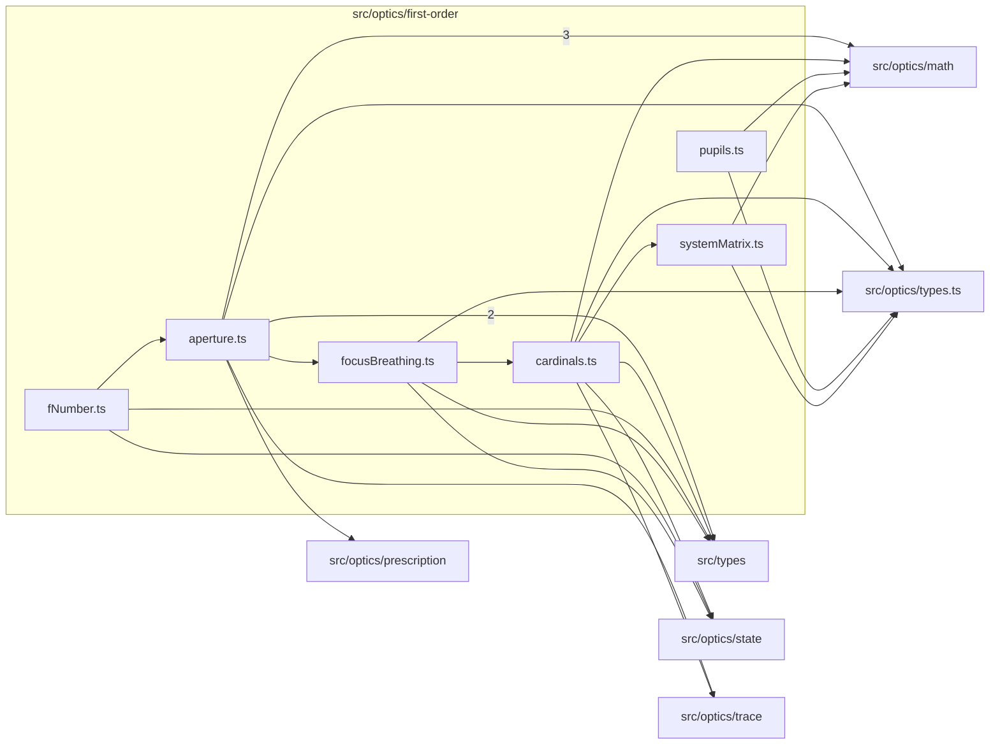

# src/optics/first-order

This folder first-order optical calculations for cardinals, pupils, f-number, focus breathing, and system matrices.

Generated `readme.md` and `improvementsuggestions.md` files are intentionally omitted from the per-file inventory so this document stays focused on source relationships.

## Relationship Diagram

```mermaid
flowchart LR
  subgraph n_src_optics_first_order["src/optics/first-order"]
    n_src_optics_first_order_src_optics_first_order_aperture_ts["aperture.ts"]
    n_src_optics_first_order_src_optics_first_order_cardinals_ts["cardinals.ts"]
    n_src_optics_first_order_src_optics_first_order_fNumber_ts["fNumber.ts"]
    n_src_optics_first_order_src_optics_first_order_focusBreathing_ts["focusBreathing.ts"]
    n_src_optics_first_order_src_optics_first_order_pupils_ts["pupils.ts"]
    n_src_optics_first_order_src_optics_first_order_systemMatrix_ts["systemMatrix.ts"]
  end
  n_external_src_optics_math["src/optics/math"]
  n_external_src_types["src/types"]
  n_external_src_optics_prescription["src/optics/prescription"]
  n_external_src_optics_state["src/optics/state"]
  n_external_src_optics_trace["src/optics/trace"]
  n_external_src_optics_types_ts["src/optics/types.ts"]
  n_src_optics_first_order_src_optics_first_order_aperture_ts --> |3| n_external_src_optics_math
  n_src_optics_first_order_src_optics_first_order_aperture_ts --> |2| n_external_src_types
  n_src_optics_first_order_src_optics_first_order_cardinals_ts --> n_external_src_optics_math
  n_src_optics_first_order_src_optics_first_order_pupils_ts --> n_external_src_optics_math
  n_src_optics_first_order_src_optics_first_order_systemMatrix_ts --> n_external_src_optics_math
  n_src_optics_first_order_src_optics_first_order_aperture_ts --> n_external_src_optics_prescription
  n_src_optics_first_order_src_optics_first_order_cardinals_ts --> n_external_src_optics_state
  n_src_optics_first_order_src_optics_first_order_fNumber_ts --> n_external_src_optics_state
  n_src_optics_first_order_src_optics_first_order_focusBreathing_ts --> n_external_src_optics_state
  n_src_optics_first_order_src_optics_first_order_aperture_ts --> n_external_src_optics_trace
  n_src_optics_first_order_src_optics_first_order_cardinals_ts --> n_external_src_optics_trace
  n_src_optics_first_order_src_optics_first_order_aperture_ts --> n_external_src_optics_types_ts
  n_src_optics_first_order_src_optics_first_order_cardinals_ts --> n_external_src_optics_types_ts
  n_src_optics_first_order_src_optics_first_order_focusBreathing_ts --> n_external_src_optics_types_ts
  n_src_optics_first_order_src_optics_first_order_pupils_ts --> n_external_src_optics_types_ts
  n_src_optics_first_order_src_optics_first_order_systemMatrix_ts --> n_external_src_optics_types_ts
  n_src_optics_first_order_src_optics_first_order_cardinals_ts --> n_external_src_types
  n_src_optics_first_order_src_optics_first_order_fNumber_ts --> n_external_src_types
  n_src_optics_first_order_src_optics_first_order_focusBreathing_ts --> n_external_src_types
  n_src_optics_first_order_src_optics_first_order_fNumber_ts --> n_src_optics_first_order_src_optics_first_order_aperture_ts
  n_src_optics_first_order_src_optics_first_order_focusBreathing_ts --> n_src_optics_first_order_src_optics_first_order_cardinals_ts
  n_src_optics_first_order_src_optics_first_order_aperture_ts --> n_src_optics_first_order_src_optics_first_order_focusBreathing_ts
  n_src_optics_first_order_src_optics_first_order_cardinals_ts --> n_src_optics_first_order_src_optics_first_order_systemMatrix_ts
```

## Directory Overview

- Direct source files: 6
- Direct subfolders: 0
- Main outbound areas: src/optics/math (6), src/optics/types.ts (5), src/types (5), same folder (4), src/optics/state (3), src/optics/trace (2), src/optics/prescription
- External consumers: src/optics/analysis, src/optics/compat.ts, src/optics/layout.ts, src/optics/optics.ts, src/optics/perspective

## Files

| File | Role | Imports from | Imported by | Exports |
| --- | --- | --- | --- | --- |
| `aperture.ts` | Aperture helper module | src/optics/math (3), src/types (2), same folder, src/optics/prescription, src/optics/trace, +1 more | src/optics/analysis (2), same folder, src/optics/optics.ts | ApertureMetrics, resolveApertureStop, apertureMetricsForState |
| `cardinals.ts` | Cardinals helper module | same folder, src/optics/math, src/optics/state, src/optics/trace, src/optics/types.ts, +1 more | same folder, src/optics/analysis, src/optics/compat.ts | CardinalPoint2, CardinalDistance2, CardinalElements2, computeCardinalElements2, buildCardinalElementsFromMatrix2, computeCardinalElementsAtState2 |
| `fNumber.ts` | F Number helper module | same folder, src/optics/state, src/types | src/optics/compat.ts, src/optics/layout.ts | effectiveFNumber2 |
| `focusBreathing.ts` | Focus Breathing helper module | same folder, src/optics/state, src/optics/types.ts, src/types | same folder, src/optics/analysis, src/optics/compat.ts, src/optics/layout.ts, src/optics/perspective | calculatedFocalLengthForState, eflAtFocus2 |
| `pupils.ts` | Pupils helper module | src/optics/math, src/optics/types.ts | src/optics/perspective (3) | FirstOrderPupilState, entrancePupilFromStop2, paraxialPupilGeometry2 |
| `systemMatrix.ts` | System Matrix helper module | src/optics/math, src/optics/types.ts | same folder | FirstOrderSystemMatrix, computeSystemMatrix2 |
