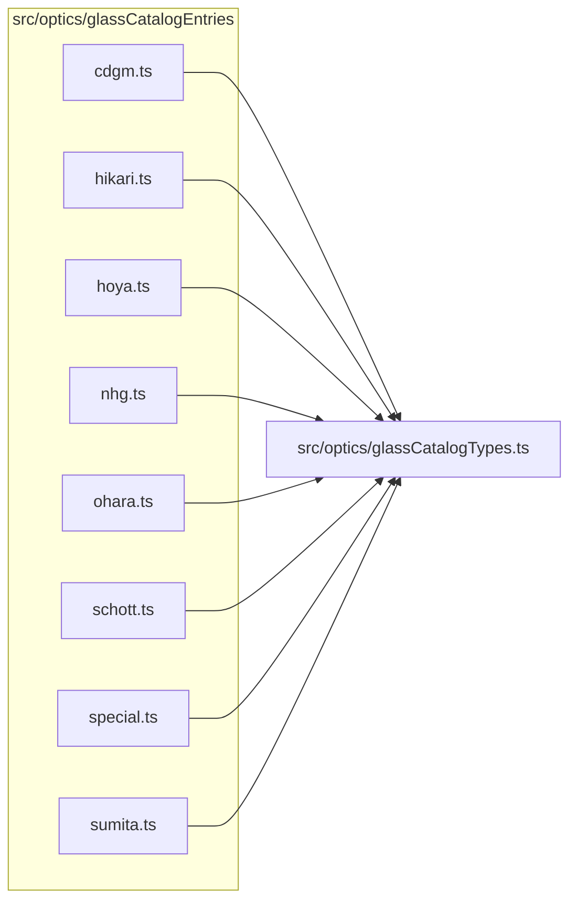

# src/optics/glassCatalogEntries

This folder src/optics/glassCatalogEntries source folder.

Generated `readme.md` and `improvementsuggestions.md` files are intentionally omitted from the per-file inventory so this document stays focused on source relationships.

## Relationship Diagram

## Directory Overview

- Direct source files: 8
- Direct subfolders: 0
- Main outbound areas: src/optics/glassCatalogTypes.ts (8)
- External consumers: src/optics/glassCatalogData.ts

## Files

| File | Role | Imports from | Imported by | Exports |
| --- | --- | --- | --- | --- |
| `cdgm.ts` | Cdgm helper module | src/optics/glassCatalogTypes.ts | src/optics/glassCatalogData.ts | CDGM_GLASS_ENTRIES |
| `hikari.ts` | Hikari helper module | src/optics/glassCatalogTypes.ts | src/optics/glassCatalogData.ts | HIKARI_GLASS_ENTRIES |
| `hoya.ts` | Hoya helper module | src/optics/glassCatalogTypes.ts | src/optics/glassCatalogData.ts | HOYA_GLASS_ENTRIES |
| `nhg.ts` | Nhg helper module | src/optics/glassCatalogTypes.ts | src/optics/glassCatalogData.ts | NHG_GLASS_ENTRIES |
| `ohara.ts` | Ohara helper module | src/optics/glassCatalogTypes.ts | src/optics/glassCatalogData.ts | OHARA_GLASS_ENTRIES |
| `schott.ts` | Schott helper module | src/optics/glassCatalogTypes.ts | src/optics/glassCatalogData.ts | SCHOTT_GLASS_ENTRIES |
| `special.ts` | Special helper module | src/optics/glassCatalogTypes.ts | src/optics/glassCatalogData.ts | SPECIAL_GLASS_ENTRIES |
| `sumita.ts` | Sumita helper module | src/optics/glassCatalogTypes.ts | src/optics/glassCatalogData.ts | SUMITA_GLASS_ENTRIES |
