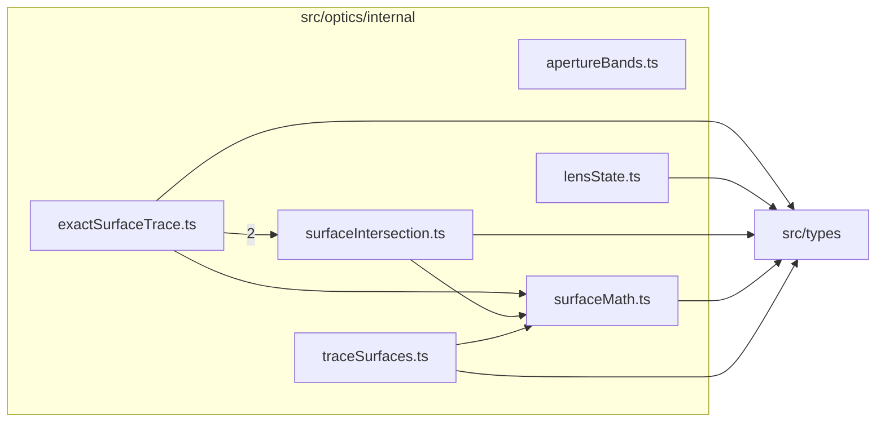

# src/optics/internal

This folder private exact surface-tracing implementation details for the optics engine.

Generated `readme.md` and `improvementsuggestions.md` files are intentionally omitted from the per-file inventory so this document stays focused on source relationships.

## Relationship Diagram

## Directory Overview

- Direct source files: 6
- Direct subfolders: 0
- Main outbound areas: same folder (5), src/types (5)
- External consumers: src/components/display, src/optics/asphericComparison.ts, src/optics/constants.ts, src/optics/diagram, src/optics/layout.ts, src/optics/math, src/optics/optics.ts, src/optics/pupilAberration.ts, +3 more

## Files

| File | Role | Imports from | Imported by | Exports |
| --- | --- | --- | --- | --- |
| `apertureBands.ts` | Aperture Bands helper module | none | src/optics/diagram, src/optics/validateLensData.ts | ApertureBandSurface, ApertureBand, materialBandForSurface, sharedMaterialBand, centralOpeningSemiDiameter, surfaceFitsInsideCentralOpening |
| `exactSurfaceTrace.ts` | Exact Surface Trace helper module | same folder (3), src/types | src/optics/pupilAberration.ts, src/optics/rayTrace.ts, src/optics/runtimeLens.ts, src/optics/validateLensData.ts | Vector3, ExactTraceSurface, ExactTraceLens, ExactSurfaceTraceInput, VectorRayInput, ExactSurfaceTraceOptions, ExactSurfaceTraceHit, ExactSurfaceTraceResult, +10 more |
| `lensState.ts` | Lens State helper module | src/types | src/optics/layout.ts, src/optics/runtimeLens.ts, src/optics/validateLensData.ts | buildLabelIndex, buildAsphereIndex, buildVarIndex, resolveAnnotations, buildElementSpans, buildVdIndex, buildSpectralIndex, firstInfinityThickness, +5 more |
| `surfaceIntersection.ts` | Surface Intersection helper module | same folder, src/types | same folder | SurfaceIntersectionFailureReason, Vector3, SurfaceIntersectionRay, SurfaceIntersectionOptions, SurfaceIntersectionLens, SurfaceIntersectionSuccess, SurfaceIntersectionFailure, SurfaceIntersectionResult, +3 more |
| `surfaceMath.ts` | Surface Math helper module | src/types | same folder (3), src/components/display, src/optics/asphericComparison.ts, src/optics/constants.ts, src/optics/layout.ts, +4 more | FLAT_R_THRESHOLD, MAX_RIM_SLOPE_TAN, DEFAULT_MAX_RIM_ANGLE_DEG, sag, conicPolySag, sagSlopeRaw |
| `traceSurfaces.ts` | Trace Surfaces helper module | same folder, src/types | src/optics/layout.ts, src/optics/pupilAberration.ts, src/optics/rayTrace.ts, src/optics/runtimeLens.ts | ParaxialRayState, ParaxialSurfaceTraceOptions, RealSurfaceTraceOptions, RealSurfaceTraceResult, transferParaxialRay, interactParaxialSurface, traceSurfacesParaxial |

