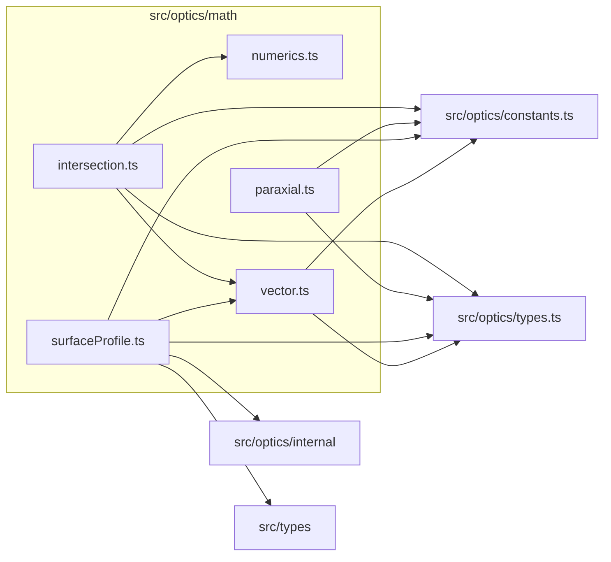

# src/optics/math

This folder low-level vector, numerical, paraxial, surface profile, and intersection math.

Generated `readme.md` and `improvementsuggestions.md` files are intentionally omitted from the per-file inventory so this document stays focused on source relationships.

## Relationship Diagram

## Directory Overview

- Direct source files: 5
- Direct subfolders: 0
- Main outbound areas: src/optics/constants.ts (4), src/optics/types.ts (4), same folder (3), src/optics/internal, src/types
- External consumers: src/optics/analysis, src/optics/field, src/optics/first-order, src/optics/prescription, src/optics/state, src/optics/trace

## Files

| File | Role | Imports from | Imported by | Exports |
| --- | --- | --- | --- | --- |
| `intersection.ts` | Intersection helper module | same folder (2), src/optics/constants.ts, src/optics/types.ts | src/optics/trace (2) | SurfaceIntersectionFailureReason, SurfaceIntersectionOptions, SurfaceIntersectionSuccess, SurfaceIntersectionFailure, SurfaceIntersectionResult, intersectSurfaceProfile |
| `numerics.ts` | Numerics helper module | none | same folder, src/optics/prescription, src/optics/state | isFiniteNumber, clamp, clamp01, lerp, nearlyEqual, normalizeControlT, formatCacheNumber |
| `paraxial.ts` | Paraxial helper module | src/optics/constants.ts, src/optics/types.ts | src/optics/first-order (4), src/optics/field | ParaxialState, ParaxialTraceOptions, ParaxialTraceResult, transferParaxialRay2, interactParaxialSurface2, traceParaxialSurfaces2 |
| `surfaceProfile.ts` | Surface Profile helper module | same folder, src/optics/constants.ts, src/optics/internal, src/optics/types.ts, src/types | src/optics/analysis, src/optics/prescription | createSurfaceProfile, createFlatProfile, createSphericalProfile, createAsphericProfile, createTiltedPlaneProfile |
| `vector.ts` | Vector helper module | src/optics/constants.ts, src/optics/types.ts | src/optics/trace (3), same folder (2), src/optics/prescription | vec3, add, subtract, scale, dot, cross, length, normalize, +5 more |

