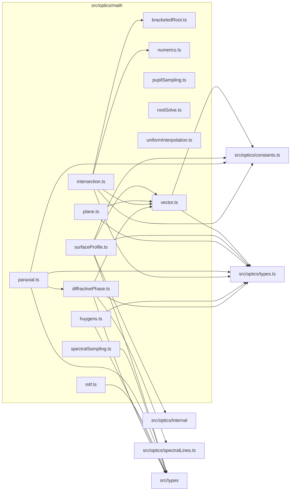

# src/optics/math

This folder low-level vector, numerical, paraxial, surface profile, and intersection math.

Generated `readme.md` and `improvementsuggestions.md` files are intentionally omitted from the per-file inventory so this document stays focused on source relationships.

## Relationship Diagram

```mermaid
flowchart LR
  subgraph n_src_optics_math["src/optics/math"]
    n_src_optics_math_src_optics_math_bracketedRoot_ts["bracketedRoot.ts"]
    n_src_optics_math_src_optics_math_diffractivePhase_ts["diffractivePhase.ts"]
    n_src_optics_math_src_optics_math_huygens_ts["huygens.ts"]
    n_src_optics_math_src_optics_math_intersection_ts["intersection.ts"]
    n_src_optics_math_src_optics_math_mtf_ts["mtf.ts"]
    n_src_optics_math_src_optics_math_numerics_ts["numerics.ts"]
    n_src_optics_math_src_optics_math_paraxial_ts["paraxial.ts"]
    n_src_optics_math_src_optics_math_plane_ts["plane.ts"]
    n_src_optics_math_src_optics_math_pupilSampling_ts["pupilSampling.ts"]
    n_src_optics_math_src_optics_math_rootSolve_ts["rootSolve.ts"]
    n_src_optics_math_src_optics_math_spectralSampling_ts["spectralSampling.ts"]
    n_src_optics_math_src_optics_math_surfaceProfile_ts["surfaceProfile.ts"]
    n_src_optics_math_src_optics_math_uniformInterpolation_ts["uniformInterpolation.ts"]
    n_src_optics_math_src_optics_math_vector_ts["vector.ts"]
  end
  n_external_src_optics_constants_ts["src/optics/constants.ts"]
  n_external_src_optics_internal["src/optics/internal"]
  n_external_src_optics_spectralLines_ts["src/optics/spectralLines.ts"]
  n_external_src_optics_types_ts["src/optics/types.ts"]
  n_external_src_types["src/types"]
  n_src_optics_math_src_optics_math_intersection_ts --> n_external_src_optics_constants_ts
  n_src_optics_math_src_optics_math_paraxial_ts --> n_external_src_optics_constants_ts
  n_src_optics_math_src_optics_math_surfaceProfile_ts --> n_external_src_optics_constants_ts
  n_src_optics_math_src_optics_math_vector_ts --> n_external_src_optics_constants_ts
  n_src_optics_math_src_optics_math_surfaceProfile_ts --> n_external_src_optics_internal
  n_src_optics_math_src_optics_math_diffractivePhase_ts --> n_external_src_optics_spectralLines_ts
  n_src_optics_math_src_optics_math_diffractivePhase_ts --> n_external_src_optics_types_ts
  n_src_optics_math_src_optics_math_huygens_ts --> n_external_src_optics_types_ts
  n_src_optics_math_src_optics_math_intersection_ts --> n_external_src_optics_types_ts
  n_src_optics_math_src_optics_math_paraxial_ts --> n_external_src_optics_types_ts
  n_src_optics_math_src_optics_math_plane_ts --> n_external_src_optics_types_ts
  n_src_optics_math_src_optics_math_surfaceProfile_ts --> n_external_src_optics_types_ts
  n_src_optics_math_src_optics_math_vector_ts --> n_external_src_optics_types_ts
  n_src_optics_math_src_optics_math_diffractivePhase_ts --> n_external_src_types
  n_src_optics_math_src_optics_math_huygens_ts --> n_external_src_types
  n_src_optics_math_src_optics_math_mtf_ts --> n_external_src_types
  n_src_optics_math_src_optics_math_paraxial_ts --> n_external_src_types
  n_src_optics_math_src_optics_math_spectralSampling_ts --> n_external_src_types
  n_src_optics_math_src_optics_math_surfaceProfile_ts --> n_external_src_types
  n_src_optics_math_src_optics_math_intersection_ts --> n_src_optics_math_src_optics_math_bracketedRoot_ts
  n_src_optics_math_src_optics_math_paraxial_ts --> n_src_optics_math_src_optics_math_diffractivePhase_ts
  n_src_optics_math_src_optics_math_intersection_ts --> n_src_optics_math_src_optics_math_numerics_ts
  n_src_optics_math_src_optics_math_diffractivePhase_ts --> n_src_optics_math_src_optics_math_vector_ts
  n_src_optics_math_src_optics_math_intersection_ts --> n_src_optics_math_src_optics_math_vector_ts
  n_src_optics_math_src_optics_math_plane_ts --> n_src_optics_math_src_optics_math_vector_ts
  n_src_optics_math_src_optics_math_surfaceProfile_ts --> n_src_optics_math_src_optics_math_vector_ts
```

## Directory Overview

- Direct source files: 14
- Direct subfolders: 0
- Main outbound areas: same folder (7), src/optics/types.ts (7), src/types (6), src/optics/constants.ts (4), src/optics/internal, src/optics/spectralLines.ts
- External consumers: src/components/display, src/optics/analysis, src/optics/compat.ts, src/optics/field, src/optics/first-order, src/optics/internal, src/optics/layout.ts, src/optics/optics.ts, +7 more

## Files

| File | Role | Imports from | Imported by | Exports |
| --- | --- | --- | --- | --- |
| `bracketedRoot.ts` | Bracketed Root helper module | none | same folder, src/optics/internal | RootEvaluation, RootResult, solveBracketedRoot |
| `diffractivePhase.ts` | Diffractive Phase helper module | same folder, src/optics/spectralLines.ts, src/optics/types.ts, src/types | src/optics/trace (3), same folder, src/optics/internal, src/optics/prescription, src/optics/runtimeLens.ts | DEFAULT_PHASE_WAVELENGTH_NM, compileDiffractivePhase, radialPhaseOpticalPath, radialPhaseDerivative, diffractiveWavelengthScale, radialPhaseKick, diffractiveRefractedDirection, diffractiveParaxialPower, +1 more |
| `huygens.ts` | Huygens helper module | src/optics/types.ts, src/types | src/optics/analysis, src/optics/optics.ts | huygensIntensity, computeHuygensPsf |
| `intersection.ts` | Intersection helper module | same folder (3), src/optics/constants.ts, src/optics/types.ts | src/optics/trace (2) | SurfaceIntersectionFailureReason, SurfaceIntersectionOptions, SurfaceIntersectionSuccess, SurfaceIntersectionFailure, SurfaceIntersectionResult, intersectSurfaceProfile |
| `mtf.ts` | Mtf helper module | src/types | src/optics/analysis, src/optics/optics.ts | computeMtfFromPsf |
| `numerics.ts` | Numerics helper module | none | src/optics/perspective (3), same folder, src/optics/first-order, src/optics/prescription, src/optics/state | isFiniteNumber, clamp, clamp01, lerp, nearlyEqual, normalizeControlT, formatCacheNumber |
| `paraxial.ts` | Paraxial helper module | same folder, src/optics/constants.ts, src/optics/types.ts, src/types | src/optics/first-order (4), src/optics/field, src/optics/internal, src/optics/perspective | ParaxialSurface, ParaxialState, ParaxialTraceOptions, ParaxialTraceResult, transferParaxialRay2, interactParaxialSurface2, traceParaxialSurfaces2 |
| `plane.ts` | Plane helper module | same folder, src/optics/types.ts | src/optics/perspective (3), src/optics/trace (2) | RayPlaneIntersection, RayPlaneIntersectionOptions, intersectRayPlane |
| `pupilSampling.ts` | Pupil Sampling helper module | none | src/optics/analysis, src/optics/perspective, src/optics/vignetteAnalysis.ts | CircularPupilPoint, createAreaWeightedCircularPupilPoints |
| `rootSolve.ts` | Root Solve helper module | none | src/optics/perspective (2) | ScalarRootEvaluation, ScalarRootSolveStatus, ScalarRootSolveOptions, ScalarRootSolveResult, solveScalarRoot |
| `spectralSampling.ts` | Spectral Sampling helper module | src/types | src/optics/trace (2), src/optics/validateLensData.ts | sampleSpectrum, sampleSurfaceThroughput, validateThroughputTable |
| `surfaceProfile.ts` | Surface Profile helper module | same folder, src/optics/constants.ts, src/optics/internal, src/optics/types.ts, src/types | src/optics/analysis, src/optics/prescription | createSurfaceProfile, createFlatProfile, createSphericalProfile, createAsphericProfile, createTiltedPlaneProfile |
| `uniformInterpolation.ts` | Uniform Interpolation helper module | none | src/optics/prescription (2), src/optics/compat.ts, src/optics/first-order, src/optics/layout.ts | uniformInterpolationSegment, interpolateUniformSchedule |
| `vector.ts` | Vector helper module | src/optics/constants.ts, src/optics/types.ts | src/optics/perspective (11), src/optics/trace (5), same folder (4), src/components/display, src/optics/prescription | vec3, add, subtract, scale, dot, cross, length, normalize, +5 more |
