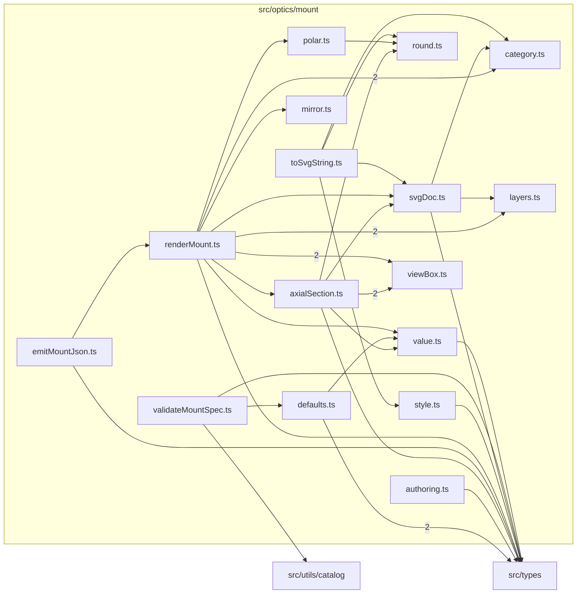

# src/optics/mount

This folder pure mount-diagram geometry, SVG document emission, validation, styling, and JSON helpers.

Generated `readme.md` and `improvementsuggestions.md` files are intentionally omitted from the per-file inventory so this document stays focused on source relationships.

## Relationship Diagram

## Directory Overview

- Direct source files: 16
- Direct subfolders: 0
- Main outbound areas: same folder (26), src/types (10), src/utils/catalog
- External consumers: src/components/mount

## Files

| File | Role | Imports from | Imported by | Exports |
| --- | --- | --- | --- | --- |
| `authoring.ts` | Authoring helper module | src/types | none | v, unknownV, naV, dirV, degListV |
| `axialSection.ts` | Axial Section helper module | same folder (5), src/types | same folder | accumulateAxialSection, tickPath |
| `category.ts` | Category helper module | none | same folder (3), src/components/mount (2) | MountFeatureCategory, CATEGORY_COLORS, CATEGORY_LABELS, CATEGORY_LEGEND_ORDER, categoryColor |
| `defaults.ts` | Defaults helper module | src/types (2), same folder | same folder | MOUNT_COORDINATE_CONVENTION, mountRenderScaffold, normalizeMountSpec |
| `emitMountJson.ts` | Emit Mount Json helper module | same folder, src/types | none | emitMountJson, emitMountJsonString |
| `layers.ts` | Layers helper module | none | same folder (2) | MountLayerName, MOUNT_LAYER_ORDER, classifyCameraFeatureLayer, classifyLensFeatureLayer |
| `mirror.ts` | Mirror helper module | none | same folder | mirrorAngleDeg, normalizeAngleDeg |
| `polar.ts` | Polar helper module | same folder | same folder | Point, polarToCartesian, clockwiseSpanDeg, circlePath, ringPath, annularSectorPath, radialLinePath, indexTrianglePath |
| `renderMount.ts` | Render Mount helper module | same folder (11), src/types | same folder, src/components/mount | MountView, buildMountSvgDoc |
| `round.ts` | Round helper module | none | same folder (3) | round3, fmt, fmtPoint |
| `style.ts` | Style helper module | src/types | same folder, src/components/mount | StatusStyle, strokeForStatus, STATUS_LEGEND_ORDER |
| `svgDoc.ts` | Svg Doc helper module | same folder (2), src/types | same folder (3), src/components/mount (2) | MountElementKind, MountSvgElement, MountSvgLayerGroup, MountLegendEntry, MountSvgDoc |
| `toSvgString.ts` | To Svg String helper module | same folder (4) | none | mountSvgDocToString |
| `validateMountSpec.ts` | Validate Mount Spec module with default export | same folder, src/types, src/utils/catalog | none | default, validateMountSpec |
| `value.ts` | Value helper module | src/types | same folder (3) | isKnown, numberOr, isKnownList, combineStatus |
| `viewBox.ts` | View Box helper module | none | same folder (2) | BBox, MOUNT_MARGIN_FRACTION, emptyBBox, includePoint, includeCircle, isEmptyBBox, computeViewBox |

