# src/optics/perspective/analysis

This folder src/optics/perspective/analysis source folder.

Generated `readme.md` and `improvementsuggestions.md` files are intentionally omitted from the per-file inventory so this document stays focused on source relationships.

## Relationship Diagram

```mermaid
flowchart LR
  subgraph n_src_optics_perspective_analysis["src/optics/perspective/analysis"]
    n_src_optics_perspective_analysis_src_optics_perspective_analysis_chromatic_ts["chromatic.ts"]
    n_src_optics_perspective_analysis_src_optics_perspective_analysis_distortion_ts["distortion.ts"]
    n_src_optics_perspective_analysis_src_optics_perspective_analysis_fieldAberrations_ts["fieldAberrations.ts"]
    n_src_optics_perspective_analysis_src_optics_perspective_analysis_focus_ts["focus.ts"]
    n_src_optics_perspective_analysis_src_optics_perspective_analysis_imageSpace_ts["imageSpace.ts"]
    n_src_optics_perspective_analysis_src_optics_perspective_analysis_index_ts["index.ts"]
    n_src_optics_perspective_analysis_src_optics_perspective_analysis_pupil_ts["pupil.ts"]
    n_src_optics_perspective_analysis_src_optics_perspective_analysis_shared_ts["shared.ts"]
    n_src_optics_perspective_analysis_src_optics_perspective_analysis_vignetting_ts["vignetting.ts"]
  end
  n_external_src_optics_math["src/optics/math"]
  n_external_src_optics_perspective["src/optics/perspective"]
  n_external_src_optics_aberration["src/optics/aberration"]
  n_external_src_optics_chromatic["src/optics/chromatic"]
  n_external_src_optics_first_order["src/optics/first-order"]
  n_external_src_optics_lensMovement_ts["src/optics/lensMovement.ts"]
  n_external_src_optics_rayTrace_ts["src/optics/rayTrace.ts"]
  n_external_src_optics_types_ts["src/optics/types.ts"]
  n_external_src_types["src/types"]
  n_external_src_utils_catalog["src/utils/catalog"]
  n_src_optics_perspective_analysis_src_optics_perspective_analysis_vignetting_ts --> |5| n_external_src_optics_math
  n_src_optics_perspective_analysis_src_optics_perspective_analysis_chromatic_ts --> |3| n_external_src_optics_perspective
  n_src_optics_perspective_analysis_src_optics_perspective_analysis_vignetting_ts --> |3| n_external_src_optics_perspective
  n_src_optics_perspective_analysis_src_optics_perspective_analysis_focus_ts --> |2| n_external_src_optics_aberration
  n_src_optics_perspective_analysis_src_optics_perspective_analysis_pupil_ts --> |2| n_external_src_optics_math
  n_src_optics_perspective_analysis_src_optics_perspective_analysis_distortion_ts --> |2| n_external_src_optics_perspective
  n_src_optics_perspective_analysis_src_optics_perspective_analysis_fieldAberrations_ts --> |2| n_external_src_optics_perspective
  n_src_optics_perspective_analysis_src_optics_perspective_analysis_focus_ts --> |2| n_external_src_optics_perspective
  n_src_optics_perspective_analysis_src_optics_perspective_analysis_imageSpace_ts --> |2| n_external_src_optics_perspective
  n_src_optics_perspective_analysis_src_optics_perspective_analysis_pupil_ts --> |2| n_external_src_optics_perspective
  n_src_optics_perspective_analysis_src_optics_perspective_analysis_shared_ts --> |2| n_external_src_optics_perspective
  n_src_optics_perspective_analysis_src_optics_perspective_analysis_fieldAberrations_ts --> n_external_src_optics_aberration
  n_src_optics_perspective_analysis_src_optics_perspective_analysis_chromatic_ts --> n_external_src_optics_chromatic
  n_src_optics_perspective_analysis_src_optics_perspective_analysis_imageSpace_ts --> n_external_src_optics_first_order
  n_src_optics_perspective_analysis_src_optics_perspective_analysis_pupil_ts --> n_external_src_optics_first_order
  n_src_optics_perspective_analysis_src_optics_perspective_analysis_vignetting_ts --> n_external_src_optics_first_order
  n_src_optics_perspective_analysis_src_optics_perspective_analysis_shared_ts --> n_external_src_optics_lensMovement_ts
  n_src_optics_perspective_analysis_src_optics_perspective_analysis_imageSpace_ts --> n_external_src_optics_math
  n_src_optics_perspective_analysis_src_optics_perspective_analysis_shared_ts --> n_external_src_optics_math
  n_src_optics_perspective_analysis_src_optics_perspective_analysis_fieldAberrations_ts --> n_external_src_optics_rayTrace_ts
  n_src_optics_perspective_analysis_src_optics_perspective_analysis_focus_ts --> n_external_src_optics_rayTrace_ts
  n_src_optics_perspective_analysis_src_optics_perspective_analysis_chromatic_ts --> n_external_src_optics_types_ts
  n_src_optics_perspective_analysis_src_optics_perspective_analysis_distortion_ts --> n_external_src_optics_types_ts
  n_src_optics_perspective_analysis_src_optics_perspective_analysis_fieldAberrations_ts --> n_external_src_optics_types_ts
  n_src_optics_perspective_analysis_src_optics_perspective_analysis_focus_ts --> n_external_src_optics_types_ts
  n_src_optics_perspective_analysis_src_optics_perspective_analysis_imageSpace_ts --> n_external_src_optics_types_ts
  n_src_optics_perspective_analysis_src_optics_perspective_analysis_pupil_ts --> n_external_src_optics_types_ts
  n_src_optics_perspective_analysis_src_optics_perspective_analysis_shared_ts --> n_external_src_optics_types_ts
  n_src_optics_perspective_analysis_src_optics_perspective_analysis_vignetting_ts --> n_external_src_optics_types_ts
  n_src_optics_perspective_analysis_src_optics_perspective_analysis_chromatic_ts --> n_external_src_types
  n_src_optics_perspective_analysis_src_optics_perspective_analysis_pupil_ts --> n_external_src_types
  n_src_optics_perspective_analysis_src_optics_perspective_analysis_vignetting_ts --> n_external_src_types
  n_src_optics_perspective_analysis_src_optics_perspective_analysis_shared_ts --> n_external_src_utils_catalog
  n_src_optics_perspective_analysis_src_optics_perspective_analysis_index_ts --> n_src_optics_perspective_analysis_src_optics_perspective_analysis_chromatic_ts
  n_src_optics_perspective_analysis_src_optics_perspective_analysis_index_ts --> n_src_optics_perspective_analysis_src_optics_perspective_analysis_distortion_ts
  n_src_optics_perspective_analysis_src_optics_perspective_analysis_index_ts --> n_src_optics_perspective_analysis_src_optics_perspective_analysis_fieldAberrations_ts
  n_src_optics_perspective_analysis_truncated["additional relationships omitted"]
```

## Directory Overview

- Direct source files: 9
- Direct subfolders: 0
- Main outbound areas: src/optics/perspective (34), src/optics/math (9), src/optics/types.ts (8), src/optics/aberration (3), src/optics/first-order (3), src/types (3), src/optics/rayTrace.ts (2), src/optics/chromatic, +2 more
- External consumers: src/optics/analysis, src/optics/perspective

## Files

| File | Role | Imports from | Imported by | Exports |
| --- | --- | --- | --- | --- |
| `chromatic.ts` | Chromatic helper module | src/optics/perspective (5), src/optics/chromatic, src/optics/types.ts, src/types | src/optics/analysis, src/optics/perspective | PerspectiveChromaticOptions, PerspectiveChromaticRayFanSample, PerspectiveChromaticRayFan, PerspectiveChromaticChannelSample, PerspectiveChromaticFieldSample, PerspectiveChromaticAnalysis, computePerspectiveChromaticAnalysis |
| `distortion.ts` | Distortion helper module | src/optics/perspective (3), src/optics/types.ts | src/optics/analysis, src/optics/perspective | PerspectiveDistortionOptions, PerspectiveDistortionSample, PerspectiveDistortionStatistics, PerspectiveDistortionSummary, PerspectiveDistortionGrid, PerspectiveDistortionAnalysis, perspectiveDistortionSampleFromField, summarizePerspectiveDistortionSamples, +1 more |
| `fieldAberrations.ts` | Field Aberrations helper module | src/optics/perspective (3), src/optics/aberration, src/optics/rayTrace.ts, src/optics/types.ts | src/optics/analysis, src/optics/perspective | PerspectiveFieldAberrationOptions, PerspectiveDirectionalFieldFocus, PerspectiveFieldCurvatureSample, PerspectiveFieldCurvatureAnalysis, PerspectiveComaRaySample, PerspectiveComaFieldSample, PerspectiveComaAnalysis, PerspectiveFieldAberrationAnalysis, +6 more |
| `focus.ts` | Focus helper module | src/optics/perspective (3), src/optics/aberration (2), src/optics/rayTrace.ts, src/optics/types.ts | src/optics/analysis, src/optics/perspective | PerspectiveFocusOptions, PerspectiveBokehFootprint, PerspectiveFocusFieldSample, PerspectiveFocusAnalysis, createPerspectiveBokehPupilPoints, computePerspectiveFocusAnalysis, focusSampleFromField, perspectiveBokehFootprint |
| `imageSpace.ts` | Image Space helper module | src/optics/perspective (3), src/optics/first-order, src/optics/math, src/optics/types.ts | src/optics/perspective (4) | PerspectiveAffineSensorRay, SensorPlaneAxis, PerspectiveFieldSensorAxes, PerspectiveSensorSpotSummary, PerspectiveSensorBestFocus, resolvePerspectivePupilSemiDiameter, affineSensorRayFromPupilSample, affineSensorRaysFromField, +5 more |
| `index.ts` | Barrel/registry module | src/optics/perspective (8) | src/optics/perspective | re-export * |
| `pupil.ts` | Pupil helper module | src/optics/perspective (3), src/optics/math (2), src/optics/first-order, src/optics/types.ts, src/types | src/optics/analysis, src/optics/perspective | PerspectivePupilOptions, IntrinsicEntrancePupil, IntrinsicExitPupil, IntrinsicPerspectivePupils, WeightedPupilRayLine, ApparentPupilLineEstimate, ApparentPerspectivePupil, PerspectivePupilSample, +4 more |
| `shared.ts` | Shared helper module | src/optics/perspective (2), src/optics/lensMovement.ts, src/optics/math, src/optics/types.ts, src/utils/catalog | src/optics/perspective (6) | SensorFrameDisplacement, sensorFrameDisplacement, createZeroMovementPerspectiveContext, sensorPointForUv, sensorUvInsideFormat, finiteRatio |
| `vignetting.ts` | Vignetting helper module | src/optics/math (5), src/optics/perspective (4), src/optics/first-order, src/optics/types.ts, src/types | src/optics/analysis, src/optics/perspective | createAreaWeightedCircularPupilPoints, PerspectiveVignettingOptions, PerspectiveVignettingRayContribution, PerspectiveVignettingThroughput, PerspectiveVignettingRatios, PerspectiveVignettingReference, PerspectiveVignettingSample, PerspectiveVignettingAnalysis, +5 more |
