# src/optics/perspective

This folder src/optics/perspective source folder.

Generated `readme.md` and `improvementsuggestions.md` files are intentionally omitted from the per-file inventory so this document stays focused on source relationships.

## Relationship Diagram

```mermaid
flowchart LR
  subgraph n_src_optics_perspective["src/optics/perspective"]
    n_src_optics_perspective_src_optics_perspective_chiefRay_ts["chiefRay.ts"]
    n_src_optics_perspective_src_optics_perspective_diagramFan_ts["diagramFan.ts"]
    n_src_optics_perspective_src_optics_perspective_diagramTrace_ts["diagramTrace.ts"]
    n_src_optics_perspective_src_optics_perspective_fieldGeometry_ts["fieldGeometry.ts"]
    n_src_optics_perspective_src_optics_perspective_fieldResults_ts["fieldResults.ts"]
    n_src_optics_perspective_src_optics_perspective_fieldSampling_ts["fieldSampling.ts"]
    n_src_optics_perspective_src_optics_perspective_fieldTypes_ts["fieldTypes.ts"]
    n_src_optics_perspective_src_optics_perspective_index_ts["index.ts"]
    n_src_optics_perspective_src_optics_perspective_pose_ts["pose.ts"]
    n_src_optics_perspective_src_optics_perspective_pupilBundle_ts["pupilBundle.ts"]
    n_src_optics_perspective_src_optics_perspective_sensorBasis_ts["sensorBasis.ts"]
    n_src_optics_perspective_src_optics_perspective_sensorTarget_ts["sensorTarget.ts"]
    n_src_optics_perspective_src_optics_perspective_trace_ts["trace.ts"]
    n_src_optics_perspective_src_optics_perspective_viewport_ts["viewport.ts"]
  end
  n_external_src_optics_trace["src/optics/trace"]
  n_external_src_optics_math["src/optics/math"]
  n_external_src_optics_chromatic["src/optics/chromatic"]
  n_external_src_optics_field["src/optics/field"]
  n_external_src_optics_first_order["src/optics/first-order"]
  n_external_src_optics_layout_ts["src/optics/layout.ts"]
  n_external_src_optics_lensMovement_ts["src/optics/lensMovement.ts"]
  n_external_src_optics_types_ts["src/optics/types.ts"]
  n_external_src_types["src/types"]
  n_src_optics_perspective_src_optics_perspective_trace_ts --> |5| n_external_src_optics_trace
  n_src_optics_perspective_src_optics_perspective_trace_ts --> |3| n_external_src_optics_math
  n_src_optics_perspective_src_optics_perspective_fieldSampling_ts --> |3| n_src_optics_perspective_src_optics_perspective_fieldGeometry_ts
  n_src_optics_perspective_src_optics_perspective_chiefRay_ts --> |2| n_external_src_optics_math
  n_src_optics_perspective_src_optics_perspective_fieldGeometry_ts --> |2| n_external_src_optics_math
  n_src_optics_perspective_src_optics_perspective_sensorTarget_ts --> |2| n_external_src_optics_math
  n_src_optics_perspective_src_optics_perspective_fieldSampling_ts --> |2| n_src_optics_perspective_src_optics_perspective_chiefRay_ts
  n_src_optics_perspective_src_optics_perspective_fieldSampling_ts --> |2| n_src_optics_perspective_src_optics_perspective_fieldTypes_ts
  n_src_optics_perspective_src_optics_perspective_fieldSampling_ts --> |2| n_src_optics_perspective_src_optics_perspective_pupilBundle_ts
  n_src_optics_perspective_src_optics_perspective_fieldSampling_ts --> |2| n_src_optics_perspective_src_optics_perspective_sensorTarget_ts
  n_src_optics_perspective_src_optics_perspective_trace_ts --> n_external_src_optics_chromatic
  n_src_optics_perspective_src_optics_perspective_chiefRay_ts --> n_external_src_optics_field
  n_src_optics_perspective_src_optics_perspective_fieldGeometry_ts --> n_external_src_optics_field
  n_src_optics_perspective_src_optics_perspective_fieldGeometry_ts --> n_external_src_optics_first_order
  n_src_optics_perspective_src_optics_perspective_fieldGeometry_ts --> n_external_src_optics_layout_ts
  n_src_optics_perspective_src_optics_perspective_pose_ts --> n_external_src_optics_lensMovement_ts
  n_src_optics_perspective_src_optics_perspective_trace_ts --> n_external_src_optics_lensMovement_ts
  n_src_optics_perspective_src_optics_perspective_fieldSampling_ts --> n_external_src_optics_math
  n_src_optics_perspective_src_optics_perspective_pose_ts --> n_external_src_optics_math
  n_src_optics_perspective_src_optics_perspective_pupilBundle_ts --> n_external_src_optics_math
  n_src_optics_perspective_src_optics_perspective_sensorBasis_ts --> n_external_src_optics_math
  n_src_optics_perspective_src_optics_perspective_chiefRay_ts --> n_external_src_optics_types_ts
  n_src_optics_perspective_src_optics_perspective_diagramFan_ts --> n_external_src_optics_types_ts
  n_src_optics_perspective_src_optics_perspective_diagramTrace_ts --> n_external_src_optics_types_ts
  n_src_optics_perspective_src_optics_perspective_fieldGeometry_ts --> n_external_src_optics_types_ts
  n_src_optics_perspective_src_optics_perspective_fieldResults_ts --> n_external_src_optics_types_ts
  n_src_optics_perspective_src_optics_perspective_fieldSampling_ts --> n_external_src_optics_types_ts
  n_src_optics_perspective_src_optics_perspective_fieldTypes_ts --> n_external_src_optics_types_ts
  n_src_optics_perspective_src_optics_perspective_pose_ts --> n_external_src_optics_types_ts
  n_src_optics_perspective_src_optics_perspective_pupilBundle_ts --> n_external_src_optics_types_ts
  n_src_optics_perspective_src_optics_perspective_sensorBasis_ts --> n_external_src_optics_types_ts
  n_src_optics_perspective_src_optics_perspective_sensorTarget_ts --> n_external_src_optics_types_ts
  n_src_optics_perspective_src_optics_perspective_trace_ts --> n_external_src_optics_types_ts
  n_src_optics_perspective_src_optics_perspective_chiefRay_ts --> n_external_src_types
  n_src_optics_perspective_src_optics_perspective_diagramFan_ts --> n_external_src_types
  n_src_optics_perspective_src_optics_perspective_diagramTrace_ts --> n_external_src_types
  n_src_optics_perspective_truncated["additional relationships omitted"]
```

## Directory Overview

- Direct source files: 14
- Direct subfolders: 0
- Main outbound areas: same folder (46), src/optics/math (13), src/optics/types.ts (12), src/types (7), src/optics/trace (5), src/optics/field (2), src/optics/lensMovement.ts (2), src/optics/chromatic, +3 more
- External consumers: none

## Files

| File | Role | Imports from | Imported by | Exports |
| --- | --- | --- | --- | --- |
| `chiefRay.ts` | Chief Ray helper module | src/optics/math (2), same folder, src/optics/field, src/optics/types.ts, src/types | same folder (7) | PerspectiveFieldStatus, PerspectiveChiefRayOptions, PerspectiveChiefRayResult, solvePerspectiveChiefRay, perspectiveTraceStatus, isPerspectiveDirectionInsideProjectionDomain |
| `diagramFan.ts` | Diagram Fan helper module | same folder (3), src/optics/types.ts, src/types | same folder | PerspectiveDiagramFanSample, PerspectiveDiagramFan, TracePerspectiveDiagramFanParams, tracePerspectiveDiagramFan, cameraDirectionForDiagramField |
| `diagramTrace.ts` | Diagram Trace helper module | same folder, src/optics/types.ts, src/types | same folder (2) | PerspectiveDiagramTrace, PerspectiveDiagramTraceOptions, perspectiveTraceToDiagram, cameraPointToDiagram, perspectiveVectorLeadPoint |
| `fieldGeometry.ts` | Field Geometry helper module | same folder (3), src/optics/math (2), src/optics/field, src/optics/first-order, src/optics/layout.ts, +2 more | same folder (5) | SensorUv, FieldPlaneFrame, PerspectiveProjectionReference, PerspectiveFieldSamplingError, requirePerspectiveImageFormatMetadata, resolvePerspectiveFocalLength, perspectiveProjectionReference, createFieldPlaneFrame, +11 more |
| `fieldResults.ts` | Field Results helper module | same folder (3), src/optics/types.ts | same folder | boundedFieldStatus, unavailableFieldSample |
| `fieldSampling.ts` | Field Sampling helper module | same folder (13), src/optics/math, src/optics/types.ts | same folder (2) | PerspectiveFieldSamplingError, SensorUv, sampleCircularPupilBundle, sampleMeridionalPupilBundle, PerspectivePupilBundle, PerspectivePupilBundleRequest, PerspectivePupilPoint, PerspectivePupilRaySample, +10 more |
| `fieldTypes.ts` | Field Types helper module | same folder (5), src/optics/types.ts | same folder (2) | FieldSampleDomain, PerspectiveFieldRequest, FieldSample, PerspectiveFieldSamplingOptions |
| `index.ts` | Barrel/registry module | same folder (8) | none | re-export * |
| `pose.ts` | Pose helper module | src/optics/lensMovement.ts, src/optics/math, src/optics/types.ts, src/types | same folder (3) | CreatePerspectivePoseParams, PerspectivePose, PerspectivePoseError, createPerspectivePose |
| `pupilBundle.ts` | Pupil Bundle helper module | same folder (3), src/optics/math, src/optics/types.ts, src/types | same folder (2) | PerspectivePupilRaySample, PerspectivePupilBundle, PerspectivePupilPoint, PerspectivePupilBundleRequest, sampleMeridionalPupilBundle, sampleCircularPupilBundle, pupilBundleForRequest |
| `sensorBasis.ts` | Sensor Basis helper module | src/optics/math, src/optics/types.ts | same folder (3) | SensorBasis, SensorBasisError, createSensorBasis |
| `sensorTarget.ts` | Sensor Target helper module | same folder (3), src/optics/math (2), src/optics/types.ts | same folder (2) | PerspectiveSensorLockSolveResult, SensorChiefSolve, solveChiefToSensorPoint |
| `trace.ts` | Trace helper module | src/optics/trace (5), src/optics/math (3), same folder (2), src/optics/chromatic, src/optics/lensMovement.ts, +2 more | same folder (9) | CreatePerspectiveTraceContextParams, PerspectiveTraceOptions, PerspectiveTraceResult, PerspectiveTraceContext, PerspectiveTraceUnsupportedError, createPerspectiveTraceContext, tracePerspectiveRay, tracePerspectiveMeridional, +1 more |
| `viewport.ts` | Viewport helper module | same folder, src/types | same folder | PerspectiveMovementViewportExtent, PerspectiveMovementViewportParams, computePerspectiveMovementViewportExtent |
