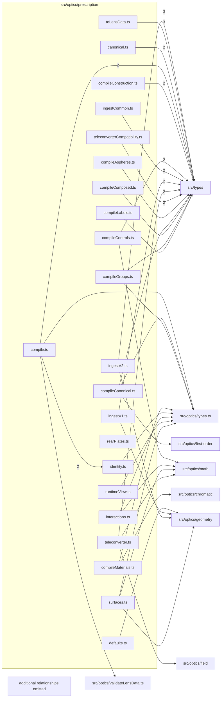

# src/optics/prescription

This folder canonical prescription ingest, compilation, composition, identity ownership, and control helpers.

Generated `readme.md` and `improvementsuggestions.md` files are intentionally omitted from the per-file inventory so this document stays focused on source relationships.

## Relationship Diagram

```mermaid
flowchart LR
  subgraph n_src_optics_prescription["src/optics/prescription"]
    n_src_optics_prescription_src_optics_prescription_canonical_ts["canonical.ts"]
    n_src_optics_prescription_src_optics_prescription_compile_ts["compile.ts"]
    n_src_optics_prescription_src_optics_prescription_compileAspheres_ts["compileAspheres.ts"]
    n_src_optics_prescription_src_optics_prescription_compileCanonical_ts["compileCanonical.ts"]
    n_src_optics_prescription_src_optics_prescription_compileComposed_ts["compileComposed.ts"]
    n_src_optics_prescription_src_optics_prescription_compileConstruction_ts["compileConstruction.ts"]
    n_src_optics_prescription_src_optics_prescription_compileControls_ts["compileControls.ts"]
    n_src_optics_prescription_src_optics_prescription_compileGroups_ts["compileGroups.ts"]
    n_src_optics_prescription_src_optics_prescription_compileLabels_ts["compileLabels.ts"]
    n_src_optics_prescription_src_optics_prescription_compileMaterials_ts["compileMaterials.ts"]
    n_src_optics_prescription_src_optics_prescription_defaults_ts["defaults.ts"]
    n_src_optics_prescription_src_optics_prescription_identity_ts["identity.ts"]
    n_src_optics_prescription_src_optics_prescription_ingestCommon_ts["ingestCommon.ts"]
    n_src_optics_prescription_src_optics_prescription_ingestV1_ts["ingestV1.ts"]
    n_src_optics_prescription_src_optics_prescription_ingestV2_ts["ingestV2.ts"]
    n_src_optics_prescription_src_optics_prescription_interactions_ts["interactions.ts"]
    n_src_optics_prescription_src_optics_prescription_rearPlates_ts["rearPlates.ts"]
    n_src_optics_prescription_src_optics_prescription_runtimeView_ts["runtimeView.ts"]
    n_src_optics_prescription_src_optics_prescription_surfaces_ts["surfaces.ts"]
    n_src_optics_prescription_src_optics_prescription_teleconverter_ts["teleconverter.ts"]
    n_src_optics_prescription_src_optics_prescription_teleconverterCompatibility_ts["teleconverterCompatibility.ts"]
    n_src_optics_prescription_src_optics_prescription_toLensData_ts["toLensData.ts"]
  end
  n_external_src_types["src/types"]
  n_external_src_optics_chromatic["src/optics/chromatic"]
  n_external_src_optics_field["src/optics/field"]
  n_external_src_optics_first_order["src/optics/first-order"]
  n_external_src_optics_geometry["src/optics/geometry"]
  n_external_src_optics_math["src/optics/math"]
  n_external_src_optics_types_ts["src/optics/types.ts"]
  n_external_src_optics_validateLensData_ts["src/optics/validateLensData.ts"]
  n_src_optics_prescription_src_optics_prescription_ingestV2_ts --> |3| n_external_src_types
  n_src_optics_prescription_src_optics_prescription_toLensData_ts --> |3| n_external_src_types
  n_src_optics_prescription_src_optics_prescription_canonical_ts --> |2| n_external_src_types
  n_src_optics_prescription_src_optics_prescription_compile_ts --> |2| n_external_src_types
  n_src_optics_prescription_src_optics_prescription_compileConstruction_ts --> |2| n_external_src_types
  n_src_optics_prescription_src_optics_prescription_compileControls_ts --> |2| n_external_src_types
  n_src_optics_prescription_src_optics_prescription_ingestCommon_ts --> |2| n_external_src_types
  n_src_optics_prescription_src_optics_prescription_ingestV1_ts --> |2| n_external_src_types
  n_src_optics_prescription_src_optics_prescription_teleconverter_ts --> |2| n_external_src_types
  n_src_optics_prescription_src_optics_prescription_teleconverterCompatibility_ts --> |2| n_external_src_types
  n_src_optics_prescription_src_optics_prescription_compile_ts --> |2| n_src_optics_prescription_src_optics_prescription_identity_ts
  n_src_optics_prescription_src_optics_prescription_compileMaterials_ts --> n_external_src_optics_chromatic
  n_src_optics_prescription_src_optics_prescription_teleconverter_ts --> n_external_src_optics_field
  n_src_optics_prescription_src_optics_prescription_compileCanonical_ts --> n_external_src_optics_first_order
  n_src_optics_prescription_src_optics_prescription_defaults_ts --> n_external_src_optics_geometry
  n_src_optics_prescription_src_optics_prescription_ingestV1_ts --> n_external_src_optics_geometry
  n_src_optics_prescription_src_optics_prescription_ingestV2_ts --> n_external_src_optics_geometry
  n_src_optics_prescription_src_optics_prescription_surfaces_ts --> n_external_src_optics_geometry
  n_src_optics_prescription_src_optics_prescription_compileControls_ts --> n_external_src_optics_math
  n_src_optics_prescription_src_optics_prescription_interactions_ts --> n_external_src_optics_math
  n_src_optics_prescription_src_optics_prescription_surfaces_ts --> n_external_src_optics_math
  n_src_optics_prescription_src_optics_prescription_teleconverter_ts --> n_external_src_optics_math
  n_src_optics_prescription_src_optics_prescription_compile_ts --> n_external_src_optics_types_ts
  n_src_optics_prescription_src_optics_prescription_compileCanonical_ts --> n_external_src_optics_types_ts
  n_src_optics_prescription_src_optics_prescription_compileGroups_ts --> n_external_src_optics_types_ts
  n_src_optics_prescription_src_optics_prescription_compileMaterials_ts --> n_external_src_optics_types_ts
  n_src_optics_prescription_src_optics_prescription_identity_ts --> n_external_src_optics_types_ts
  n_src_optics_prescription_src_optics_prescription_interactions_ts --> n_external_src_optics_types_ts
  n_src_optics_prescription_src_optics_prescription_runtimeView_ts --> n_external_src_optics_types_ts
  n_src_optics_prescription_src_optics_prescription_surfaces_ts --> n_external_src_optics_types_ts
  n_src_optics_prescription_src_optics_prescription_compile_ts --> n_external_src_optics_validateLensData_ts
  n_src_optics_prescription_src_optics_prescription_compileAspheres_ts --> n_external_src_types
  n_src_optics_prescription_src_optics_prescription_compileCanonical_ts --> n_external_src_types
  n_src_optics_prescription_src_optics_prescription_compileComposed_ts --> n_external_src_types
  n_src_optics_prescription_src_optics_prescription_compileGroups_ts --> n_external_src_types
  n_src_optics_prescription_src_optics_prescription_compileLabels_ts --> n_external_src_types
  n_src_optics_prescription_truncated["additional relationships omitted"]
```

## Directory Overview

- Direct source files: 22
- Direct subfolders: 0
- Main outbound areas: same folder (49), src/types (34), src/optics/types.ts (8), src/optics/geometry (4), src/optics/math (4), src/utils/catalog (3), src/optics/chromatic, src/optics/field, +2 more
- External consumers: src/optics/analysis, src/optics/buildLens.ts, src/optics/chromatic, src/optics/compat.ts, src/optics/diagram, src/optics/dispersion.ts, src/optics/field, src/optics/first-order, +9 more

## Files

| File | Role | Imports from | Imported by | Exports |
| --- | --- | --- | --- | --- |
| `canonical.ts` | Canonical helper module | src/types (2), src/utils/catalog | same folder (8), src/optics/validateLensData.ts | FLAT_RADIUS, CanonicalRadius, CanonicalAsphere, CanonicalMediumRef, CanonicalMedium, CanonicalSurface, CanonicalElement, CanonicalRearPlate, +26 more |
| `compile.ts` | Compile helper module | same folder (8), src/types (2), src/optics/types.ts, src/optics/validateLensData.ts | src/optics/chromatic (2), src/optics/first-order (2), src/optics/analysis, src/optics/buildLens.ts, src/optics/compat.ts, +4 more | compiledLensFromRuntime, validateAuthoredLensData, withLensDefaults, compileLens, compileLensData |
| `compileAspheres.ts` | Compile Aspheres helper module | same folder, src/types | same folder, src/optics/validateLensData.ts | compileAspheres, buildAsphereIndex |
| `compileCanonical.ts` | Compile Canonical helper module | same folder (4), src/optics/first-order, src/optics/types.ts, src/types | same folder | compileCanonicalUncached, compilePrescription, completeCompilation |
| `compileComposed.ts` | Compile Composed helper module | same folder, src/types | same folder (2) | canonicalFromComposedPair |
| `compileConstruction.ts` | Compile Construction helper module | same folder (7), src/types (2) | same folder | compileConstruction, LensConstruction |
| `compileControls.ts` | Compile Controls helper module | src/types (2), same folder, src/optics/math | same folder (2), src/optics/first-order, src/optics/layout.ts, src/optics/publishedStations.ts, src/optics/state, +1 more | DEFAULT_FOCUS_POSITIONS, compileVariableGaps, compileVariableLabels, resolveVariableThickness, resolveAberrationThickness, resolveControlledThickness, buildVarIndex, firstInfinityThickness, +3 more |
| `compileGroups.ts` | Compile Groups helper module | same folder, src/optics/types.ts, src/types | same folder | compileElements, compileAnnotations |
| `compileLabels.ts` | Compile Labels helper module | src/types | same folder (5), src/optics/validateLensData.ts | Optics2LensNormalizationError, buildSurfaceLabelMap, resolveLabel, buildLabelIndex |
| `compileMaterials.ts` | Compile Materials helper module | src/optics/chromatic, src/optics/types.ts, src/types | same folder, src/optics/buildLens.ts, src/optics/chromatic, src/optics/dispersion.ts | compileSurfaceDispersions, buildVdIndex, buildSpectralIndex, resolveMaterialTable, compiledDispersionTable |
| `defaults.ts` | Defaults helper module | src/optics/geometry, src/types | same folder (5) | SchemaDefault, LENS_SCHEMA_DEFAULTS, ELEMENT_SCHEMA_DEFAULTS, REAR_PLATE_SCHEMA_DEFAULTS, takesDefault, defaultValue, v1CatalogDefaults |
| `identity.ts` | Identity helper module | same folder, src/optics/types.ts, src/types | same folder (4), src/optics/buildLens.ts, src/optics/chromatic | associateCanonical, canonicalForView, associateRuntime, compiledLensFromRuntime |
| `ingestCommon.ts` | Ingest Common helper module | same folder (2), src/types (2) | same folder (2) | Untyped, IngestContext, copy, has, put, isNumberList, isRecord, refuseUnknownFields, +6 more |
| `ingestV1.ts` | Ingest V1 helper module | same folder (3), src/types (2), src/optics/geometry | same folder (3), src/optics/buildLens.ts, src/optics/validateTeleconverterData.ts | V1_FLAT_RADIUS, ingestLensV1, mapTrustedComposedLens, ingestTeleconverterV1 |
| `ingestV2.ts` | Ingest V2 helper module | same folder (4), src/types (3), src/optics/geometry | same folder (2), src/optics/buildLens.ts | LENS_DATA_V2_SCHEMA, ingestLensV2, ingestTeleconverterV2, isV1File, ingestLens, ingestTeleconverter |
| `interactions.ts` | Interactions helper module | src/optics/math, src/optics/types.ts, src/types | same folder (2), src/optics/first-order, src/optics/validateLensData.ts | yzNormalToVec3, compileSurfaceInteraction, resolvedImagePlaneToPlane3, imagePlaneDataToPlane3 |
| `rearPlates.ts` | Rear Plates helper module | same folder (6), src/types, src/utils/catalog | same folder (3), src/optics/buildLens.ts, src/optics/validateLensData.ts | REAR_PLATE_LABEL_PATTERN, rearPlateSurfaceLabels, rearPlateAirEquivalentMm, ExpandedCanonicalLens, expandCanonicalRearPlates, expandedConstruction, expandRearPlates, lastLensSurfaceIndex |
| `runtimeView.ts` | Runtime View helper module | same folder, src/optics/types.ts, src/types | src/optics/analysis (13), src/optics/compat.ts, src/optics/perspective | associateRuntimeView, runtimeView |
| `surfaces.ts` | Surfaces helper module | same folder, src/optics/geometry, src/optics/math, src/optics/types.ts, src/types | same folder, src/optics/first-order, src/optics/validateLensData.ts | compileSurfaces |
| `teleconverter.ts` | Teleconverter helper module | same folder (4), src/types (2), src/optics/field, src/optics/math, src/utils/catalog | src/optics/teleconverter.ts, src/optics/validateTeleconverterData.ts | TeleconverterAttachError, teleconverterSurfaceLabel, teleconverterGroupLabel, mergeTeleconverterPrescription, attachTeleconverter |
| `teleconverterCompatibility.ts` | Teleconverter Compatibility helper module | src/types (2) | same folder (2), src/optics/teleconverter.ts, src/optics/validateLensData.ts, src/optics/validateTeleconverterData.ts | TELECONVERTER_LABEL_PREFIX, MIN_TELECONVERTER_GAP_MM, TeleconverterHost, rearPlateAirEquivalentMm, teleconverterGeometry, teleconverterCompatibility |
| `toLensData.ts` | To Lens Data helper module | same folder (4), src/types (3) | same folder (2), src/optics/buildLens.ts, src/optics/validateTeleconverterData.ts | toLensData, canonicalConstructionData, toLensDataInput, toTeleconverterData |
