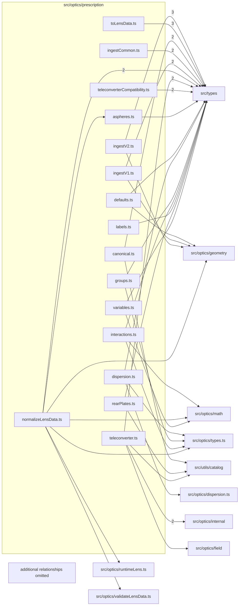

# src/optics/prescription

This folder lens prescription normalization, variable gaps, labels, groups, dispersion, interactions, and aspheric helpers.

Generated `readme.md` and `improvementsuggestions.md` files are intentionally omitted from the per-file inventory so this document stays focused on source relationships.

## Relationship Diagram

```mermaid
flowchart LR
  subgraph n_src_optics_prescription["src/optics/prescription"]
    n_src_optics_prescription_src_optics_prescription_aspheres_ts["aspheres.ts"]
    n_src_optics_prescription_src_optics_prescription_canonical_ts["canonical.ts"]
    n_src_optics_prescription_src_optics_prescription_defaults_ts["defaults.ts"]
    n_src_optics_prescription_src_optics_prescription_dispersion_ts["dispersion.ts"]
    n_src_optics_prescription_src_optics_prescription_groups_ts["groups.ts"]
    n_src_optics_prescription_src_optics_prescription_ingestCommon_ts["ingestCommon.ts"]
    n_src_optics_prescription_src_optics_prescription_ingestV1_ts["ingestV1.ts"]
    n_src_optics_prescription_src_optics_prescription_ingestV2_ts["ingestV2.ts"]
    n_src_optics_prescription_src_optics_prescription_interactions_ts["interactions.ts"]
    n_src_optics_prescription_src_optics_prescription_labels_ts["labels.ts"]
    n_src_optics_prescription_src_optics_prescription_normalizeLensData_ts["normalizeLensData.ts"]
    n_src_optics_prescription_src_optics_prescription_rearPlates_ts["rearPlates.ts"]
    n_src_optics_prescription_src_optics_prescription_teleconverter_ts["teleconverter.ts"]
    n_src_optics_prescription_src_optics_prescription_teleconverterCompatibility_ts["teleconverterCompatibility.ts"]
    n_src_optics_prescription_src_optics_prescription_toLensData_ts["toLensData.ts"]
    n_src_optics_prescription_src_optics_prescription_variables_ts["variables.ts"]
  end
  n_external_src_types["src/types"]
  n_external_src_optics_internal["src/optics/internal"]
  n_external_src_optics_dispersion_ts["src/optics/dispersion.ts"]
  n_external_src_optics_field["src/optics/field"]
  n_external_src_optics_geometry["src/optics/geometry"]
  n_external_src_optics_math["src/optics/math"]
  n_external_src_optics_runtimeLens_ts["src/optics/runtimeLens.ts"]
  n_external_src_optics_types_ts["src/optics/types.ts"]
  n_external_src_optics_validateLensData_ts["src/optics/validateLensData.ts"]
  n_external_src_utils_catalog["src/utils/catalog"]
  n_src_optics_prescription_src_optics_prescription_ingestV2_ts --> |3| n_external_src_types
  n_src_optics_prescription_src_optics_prescription_toLensData_ts --> |3| n_external_src_types
  n_src_optics_prescription_src_optics_prescription_teleconverter_ts --> |2| n_external_src_optics_internal
  n_src_optics_prescription_src_optics_prescription_canonical_ts --> |2| n_external_src_types
  n_src_optics_prescription_src_optics_prescription_ingestCommon_ts --> |2| n_external_src_types
  n_src_optics_prescription_src_optics_prescription_ingestV1_ts --> |2| n_external_src_types
  n_src_optics_prescription_src_optics_prescription_normalizeLensData_ts --> |2| n_external_src_types
  n_src_optics_prescription_src_optics_prescription_teleconverter_ts --> |2| n_external_src_types
  n_src_optics_prescription_src_optics_prescription_teleconverterCompatibility_ts --> |2| n_external_src_types
  n_src_optics_prescription_src_optics_prescription_dispersion_ts --> n_external_src_optics_dispersion_ts
  n_src_optics_prescription_src_optics_prescription_teleconverter_ts --> n_external_src_optics_field
  n_src_optics_prescription_src_optics_prescription_defaults_ts --> n_external_src_optics_geometry
  n_src_optics_prescription_src_optics_prescription_ingestV1_ts --> n_external_src_optics_geometry
  n_src_optics_prescription_src_optics_prescription_ingestV2_ts --> n_external_src_optics_geometry
  n_src_optics_prescription_src_optics_prescription_normalizeLensData_ts --> n_external_src_optics_geometry
  n_src_optics_prescription_src_optics_prescription_interactions_ts --> n_external_src_optics_math
  n_src_optics_prescription_src_optics_prescription_normalizeLensData_ts --> n_external_src_optics_math
  n_src_optics_prescription_src_optics_prescription_variables_ts --> n_external_src_optics_math
  n_src_optics_prescription_src_optics_prescription_normalizeLensData_ts --> n_external_src_optics_runtimeLens_ts
  n_src_optics_prescription_src_optics_prescription_dispersion_ts --> n_external_src_optics_types_ts
  n_src_optics_prescription_src_optics_prescription_groups_ts --> n_external_src_optics_types_ts
  n_src_optics_prescription_src_optics_prescription_interactions_ts --> n_external_src_optics_types_ts
  n_src_optics_prescription_src_optics_prescription_normalizeLensData_ts --> n_external_src_optics_types_ts
  n_src_optics_prescription_src_optics_prescription_normalizeLensData_ts --> n_external_src_optics_validateLensData_ts
  n_src_optics_prescription_src_optics_prescription_aspheres_ts --> n_external_src_types
  n_src_optics_prescription_src_optics_prescription_defaults_ts --> n_external_src_types
  n_src_optics_prescription_src_optics_prescription_dispersion_ts --> n_external_src_types
  n_src_optics_prescription_src_optics_prescription_groups_ts --> n_external_src_types
  n_src_optics_prescription_src_optics_prescription_interactions_ts --> n_external_src_types
  n_src_optics_prescription_src_optics_prescription_labels_ts --> n_external_src_types
  n_src_optics_prescription_src_optics_prescription_rearPlates_ts --> n_external_src_types
  n_src_optics_prescription_src_optics_prescription_variables_ts --> n_external_src_types
  n_src_optics_prescription_src_optics_prescription_canonical_ts --> n_external_src_utils_catalog
  n_src_optics_prescription_src_optics_prescription_rearPlates_ts --> n_external_src_utils_catalog
  n_src_optics_prescription_src_optics_prescription_teleconverter_ts --> n_external_src_utils_catalog
  n_src_optics_prescription_src_optics_prescription_normalizeLensData_ts --> n_src_optics_prescription_src_optics_prescription_aspheres_ts
  n_src_optics_prescription_truncated["additional relationships omitted"]
```

## Directory Overview

- Direct source files: 16
- Direct subfolders: 0
- Main outbound areas: same folder (28), src/types (26), src/optics/geometry (4), src/optics/types.ts (4), src/optics/math (3), src/utils/catalog (3), src/optics/internal (2), src/optics/dispersion.ts, +3 more
- External consumers: src/optics/analysis, src/optics/buildLens.ts, src/optics/chromatic, src/optics/compat.ts, src/optics/diagram, src/optics/field, src/optics/first-order, src/optics/internal, +6 more

## Files

| File | Role | Imports from | Imported by | Exports |
| --- | --- | --- | --- | --- |
| `aspheres.ts` | Aspheres helper module | same folder, src/types | same folder | compileAspheres |
| `canonical.ts` | Canonical helper module | src/types (2), src/utils/catalog | same folder (5), src/optics/validateLensData.ts | FLAT_RADIUS, CanonicalRadius, CanonicalAsphere, CanonicalMediumRef, CanonicalMedium, CanonicalSurface, CanonicalElement, CanonicalRearPlate, +26 more |
| `defaults.ts` | Defaults helper module | src/optics/geometry, src/types | same folder (5) | SchemaDefault, LENS_SCHEMA_DEFAULTS, ELEMENT_SCHEMA_DEFAULTS, REAR_PLATE_SCHEMA_DEFAULTS, takesDefault, defaultValue, v1CatalogDefaults |
| `dispersion.ts` | Dispersion helper module | src/optics/dispersion.ts, src/optics/types.ts, src/types | same folder, src/optics/chromatic | compileSurfaceDispersions |
| `groups.ts` | Groups helper module | same folder, src/optics/types.ts, src/types | same folder | compileElements, compileAnnotations |
| `ingestCommon.ts` | Ingest Common helper module | same folder (2), src/types (2) | same folder (2) | Untyped, IngestContext, copy, has, put, isNumberList, isRecord, refuseUnknownFields, +6 more |
| `ingestV1.ts` | Ingest V1 helper module | same folder (3), src/types (2), src/optics/geometry | same folder (2), src/optics/buildLens.ts, src/optics/validateTeleconverterData.ts | V1_FLAT_RADIUS, ingestLensV1, ingestTeleconverterV1 |
| `ingestV2.ts` | Ingest V2 helper module | same folder (4), src/types (3), src/optics/geometry | same folder, src/optics/buildLens.ts | LENS_DATA_V2_SCHEMA, ingestLensV2, ingestTeleconverterV2, isV1File, ingestLens, ingestTeleconverter |
| `interactions.ts` | Interactions helper module | src/optics/math, src/optics/types.ts, src/types | same folder | yzNormalToVec3, compileSurfaceInteraction, resolvedImagePlaneToPlane3, imagePlaneDataToPlane3 |
| `labels.ts` | Labels helper module | src/types | same folder (4) | Optics2LensNormalizationError, buildSurfaceLabelMap, resolveLabel |
| `normalizeLensData.ts` | Normalize Lens Data helper module | same folder (9), src/types (2), src/optics/geometry, src/optics/math, src/optics/runtimeLens.ts, +2 more | src/optics/chromatic (2), src/optics/first-order (2), src/optics/analysis, src/optics/buildLens.ts, src/optics/compat.ts, +3 more | validateAuthoredLensData, withLensDefaults, normalizeLensData, normalizeRuntimeLens |
| `rearPlates.ts` | Rear Plates helper module | same folder (2), src/types, src/utils/catalog | same folder, src/optics/runtimeLens.ts, src/optics/validateLensData.ts | REAR_PLATE_LABEL_PATTERN, rearPlateSurfaceLabels, rearPlateAirEquivalentMm, expandRearPlates, lastLensSurfaceIndex |
| `teleconverter.ts` | Teleconverter helper module | same folder (2), src/optics/internal (2), src/types (2), src/optics/field, src/utils/catalog | src/optics/teleconverter.ts, src/optics/validateTeleconverterData.ts | TeleconverterAttachError, teleconverterSurfaceLabel, teleconverterGroupLabel, mergeTeleconverterPrescription, attachTeleconverter |
| `teleconverterCompatibility.ts` | Teleconverter Compatibility helper module | src/types (2) | same folder (2), src/optics/teleconverter.ts, src/optics/validateLensData.ts, src/optics/validateTeleconverterData.ts | TELECONVERTER_LABEL_PREFIX, MIN_TELECONVERTER_GAP_MM, TeleconverterHost, rearPlateAirEquivalentMm, teleconverterGeometry, teleconverterCompatibility |
| `toLensData.ts` | To Lens Data helper module | same folder (3), src/types (3) | same folder, src/optics/buildLens.ts, src/optics/validateTeleconverterData.ts | toLensData, toLensDataInput, toTeleconverterData |
| `variables.ts` | Variables helper module | same folder, src/optics/math, src/types | same folder, src/optics/internal, src/optics/state | DEFAULT_FOCUS_POSITIONS, compileVariableGaps, compileVariableLabels, resolveVariableThickness, resolveAberrationThickness, resolveControlledThickness |
