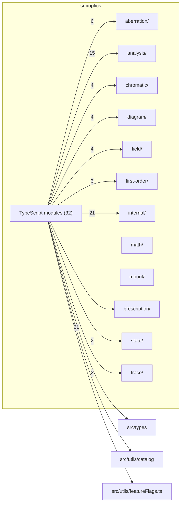

# src/optics

This folder pure optical engine, runtime-lens construction, tracing, analysis, projection, glass, mount rendering, and diagram geometry.

Generated `readme.md` and `improvementsuggestions.md` files are intentionally omitted from the per-file inventory so this document stays focused on source relationships.

## Relationship Diagram

## Directory Overview

- Direct source files: 32
- Direct subfolders: 12
- Main outbound areas: src/optics/internal (21), src/types (21), src/optics/analysis (15), src/optics/compat.ts (11), src/optics/optics.ts (8), src/optics/aberration (6), src/optics/chromatic (4), src/optics/diagram (4), +20 more
- External consumers: src/benchmarks, src/comparison, src/components/controls, src/components/diagram, src/components/display, src/components/hooks, src/components/layout, src/optics/aberration, +9 more

## Subfolders

| Folder | Role |
| --- | --- |
| [aberration/](aberration/readme.md) | engine-native aberration analysis primitives and shared aberration types |
| [analysis/](analysis/readme.md) | prepared-state analysis adapters and grouped analysis facades |
| [chromatic/](chromatic/readme.md) | chromatic channel, trace, dispersion, and quality helpers |
| [diagram/](diagram/readme.md) | pure SVG-ready diagram geometry helpers used by React diagram layers |
| [field/](field/readme.md) | engine-native field geometry, chief-ray solving, projection, and launch helpers |
| [first-order/](first-order/readme.md) | first-order optical calculations for cardinals, pupils, f-number, focus breathing, and system matrices |
| [internal/](internal/readme.md) | private exact surface-tracing implementation details for the optics engine |
| [math/](math/readme.md) | low-level vector, numerical, paraxial, surface profile, and intersection math |
| [mount/](mount/readme.md) | pure mount-diagram geometry, SVG document emission, validation, styling, and JSON helpers |
| [prescription/](prescription/readme.md) | lens prescription normalization, variable gaps, labels, groups, dispersion, interactions, and aspheric helpers |
| [state/](state/readme.md) | engine-native prepared optical state and cache helpers |
| [trace/](trace/readme.md) | exact tracing adapters, path planning, folded diagnostics, stop tracing, and aperture/interactions primitives |

## Files

| File | Role | Imports from | Imported by | Exports |
| --- | --- | --- | --- | --- |
| `aberrationAnalysis.ts` | Aberration Analysis helper module | src/optics/aberration (6) | src/components/display (20), src/optics/analysis | re-export *, computeSAProfile, computeSphericalAberration, computeSphericalAberrationBlurCharacter, computeComaAnalysis, computeComaPointCloudPreview, computeComaPreview, computeMeridionalComa, +12 more |
| `analysisJobs.ts` | Analysis Jobs helper module | src/optics/analysis | none | analysisJobs |
| `asphericComparison.ts` | Aspheric Comparison helper module | src/optics/internal, src/types | src/components/display | DepartureSample, computeAsphericDeparture, computeDepartureProfile, computeBestFitSphereR, peakAbsDeparture, rmsDeparture, nearestSurfaceForClick |
| `buildLens.ts` | Build Lens module with default export | src/optics/compat.ts, src/optics/runtimeLens.ts | src/benchmarks, src/comparison, src/components/hooks | paraxialTrace, realTraceToStop, default |
| `cardinalElements.ts` | Cardinal Elements helper module | src/optics/compat.ts | src/components/diagram (3), src/benchmarks, src/components/hooks, src/components/layout | computeCardinalElements, computeCardinalElementsAtState, CardinalDistance, CardinalElements, CardinalPoint |
| `chiefRayDiagnostics.ts` | Chief Ray Diagnostics helper module | src/optics/compat.ts | none | getChiefRayDiagnostics, resetChiefRayDiagnostics, ChiefRayStatusCounts, ChiefRayStatus |
| `chromaticRayFanScaling.ts` | Chromatic Ray Fan Scaling helper module | src/types | src/components/diagram (2) | REFERENCE_LOCA_MM, REFERENCE_FAN_IMAGE_HEIGHT_SPREAD_MM, ChromaticBarResult, computeChromaticBarOffsets, computeLocaBarOffsets |
| `compat.ts` | Compat helper module | src/optics/analysis (12), src/optics/chromatic (4), src/optics/diagram (4), src/optics/field (3), src/optics/first-order (3), +6 more | src/components/display (15), src/components/layout (2), src/benchmarks, src/optics/buildLens.ts, src/optics/cardinalElements.ts, +6 more | buildLens2, engineLensFromRuntime, prepareRuntimeState, doLayout2, thick2, eflAtZoom2, epAtZoom2, fopenAtZoom2, +167 more |
| `constants.ts` | Constants helper module | src/optics/glassCatalog.ts, src/optics/internal, src/types | src/optics/math (4), src/optics/analysis, src/optics/diagram, src/optics/trace | DEFAULT_MAX_RIM_ANGLE_DEG, FLAT_R_THRESHOLD, MAX_RIM_SLOPE_TAN, VECTOR_EPSILON, INTERSECTION_TOLERANCE, INTERSECTION_MAX_ITERATIONS, INTERSECTION_BRACKET_SAMPLES, CHROMATIC_CHANNEL_WAVELENGTH_NM |
| `diagramGeometry.ts` | Diagram Geometry helper module | src/optics/compat.ts | src/benchmarks, src/components/hooks | computeElementRenderDiagnostics, computeElementShapes, createCoordinateTransforms, DiagramPointTransform |
| `dispersion.ts` | Dispersion helper module | src/optics/glassCatalog.ts, src/types | src/components/diagram (6), src/optics/chromatic (2), src/components/display, src/components/layout, src/optics/prescription, +2 more | DispersionQuality, SurfaceIndexFn, SurfaceDispersion, makeSurfaceDispersion, buildSurfaceDispersionIndex, indexAt, summarizeDispersionQuality |
| `distortionAnalysis.ts` | Distortion Analysis helper module | src/optics/optics.ts (2), src/optics/analysis, src/optics/projection.ts, src/optics/raySampling.ts, src/types | src/components/display (2), src/optics/analysis | DistortionSample, DistortionGridPoint, DistortionGridLine, DistortionFieldGridResult, computeDistortionCurve, computeDistortionFieldGrid |
| `fieldGeometry.ts` | Field Geometry helper module | src/optics/compat.ts | none | chiefRayImageHeight, chiefRayImageHeightAccurate, computeAnalysisFieldGeometryAtState, computeBoundingSphereLaunchRadiusMm, computeBoundingSphereVectorFieldLaunch, computeFieldGeometryAtState, conjugateK, entrancePupilAtState, +13 more |
| `foldedPathDisplay.ts` | Folded Path Display helper module | src/optics/optics.ts, src/optics/raySampling.ts, src/types | src/components/layout | foldedHitOrderLabelsForDisplay |
| `glassCatalog.ts` | Glass Catalog helper module | src/optics/glassCatalogData.ts (2), src/optics/glassCatalogAliases.ts | src/optics/chromatic, src/optics/constants.ts, src/optics/dispersion.ts, src/optics/types.ts | GlassEntry, LINE_NM, evaluateSellmeier, assertCatalogConsistent, resolveGlass, catalogSize, allEntries |
| `glassCatalogAliases.ts` | Glass Catalog Aliases helper module | none | src/optics/glassCatalog.ts | ALIASES |
| `glassCatalogData.ts` | Glass Catalog Data helper module | none | src/optics/glassCatalog.ts | GlassEntry, RAW_CATALOG |
| `groupMovement.ts` | Group Movement helper module | src/types (2), src/optics/optics.ts | src/comparison, src/components/controls, src/components/display, src/optics/analysis | LensMovementGroup, GroupMovementPoint, GroupMovementSeries, GroupMovementAvailability, GroupMovementProfile, getGroupMovementAvailability, isGroupMovementModeAvailable, firstAvailableGroupMovementMode, +2 more |
| `index.ts` | Barrel/registry module | src/optics/compat.ts, src/optics/types.ts | none | re-export * |
| `layout.ts` | Layout helper module | src/optics/internal (3), src/types | src/optics/analysis (2), src/optics/first-order (2), src/optics/chromatic, src/optics/optics.ts, src/optics/opticsFormat.ts, +2 more | SVG_PATH_SUBDIVISIONS, FOCUS_INFINITY_THRESHOLD, renderSag, sagSlope, gapTrimHeight, slopeTrimHeight, thick, doLayout, +13 more |
| `lensMovement.ts` | Lens Movement helper module | src/types | src/components/hooks (5), src/comparison, src/components/controls, src/components/diagram, src/components/layout | LensMovementState, ResolvedLensMovement, LensMovementTransform, ZERO_LENS_MOVEMENT, perspectiveControlSteps, isIdentityLensMovement, clampLensMovement, transformMovedPoint, +4 more |
| `optics.ts` | Optics helper module | src/optics/compat.ts (4), src/optics/internal, src/optics/layout.ts, src/optics/opticsFormat.ts, src/optics/rayTrace.ts, +1 more | src/components/display (11), src/optics/analysis (8), src/optics/aberration (7), src/components/hooks (6), src/comparison (3), +9 more | FLAT_R_THRESHOLD, conicPolySag, sag, sagSlopeRaw, FOCUS_INFINITY_THRESHOLD, SVG_PATH_SUBDIVISIONS, bAtZoom, epZRelStopAtZoom, +70 more |
| `opticsFormat.ts` | Optics Format helper module | src/optics/layout.ts, src/types | src/optics/optics.ts | formatDist, formatPetzvalRadius |
| `projection.ts` | Projection helper module | src/optics/compat.ts | src/components/controls (2), src/components/hooks, src/components/layout, src/optics/aberration, src/optics/distortionAnalysis.ts, +2 more | ABSOLUTE_HALF_FIELD_CEILING, MAX_FIELD_LAUNCH_DEG, TRACING_SAFETY_FACTOR, boundingSphereLaunchVector, distortionProjectionReferenceForLens, fisheyeProjectionFocalLengthAtZoom, fisheyeProjectionMaxTraceFieldAtZoom, isFisheyeProjection, +16 more |
| `pupilAberration.ts` | Pupil Aberration helper module | src/optics/internal (3), src/optics/optics.ts (2), src/optics/layout.ts, src/optics/projection.ts, src/types | src/components/display, src/optics/analysis | PupilAberrationSample, PupilAberrationProfile, ExitPupilAberrationSample, ExitPupilAberrationProfile, PUPIL_ABERRATION_SAMPLE_COUNT, computePupilAberrationProfile, computeExitPupilAberrationProfile, BothPupilAberrationProfiles, +1 more |
| `raySampling.ts` | Ray Sampling helper module | src/types (2), src/optics/stopObstruction.ts | src/components/hooks (3), src/benchmarks, src/components/layout, src/optics/distortionAnalysis.ts, src/optics/field, +2 more | isHeavyLensForRayWork, rayFractionsForDensity, obstructionAwareRayFractionsForDensity, raySampleCountForDensity |
| `rayTrace.ts` | Ray Trace helper module | src/optics/internal (2), src/optics/layout.ts, src/types | src/optics/analysis, src/optics/optics.ts | SkewRayTraceResult, VectorRayTraceInput, SkewImagePlaneIntercept, OrthogonalPupilSample, CircularPupilSample, DEFAULT_ORTHOGONAL_PUPIL_FAN_SAMPLE_COUNT, DEFAULT_CIRCULAR_PUPIL_RING_SAMPLES, wavelengthNd, +15 more |
| `runtimeLens.ts` | Runtime Lens module with default export | src/optics/internal (5), src/optics/dispersion.ts, src/optics/field, src/optics/validateLensData.ts, src/types, +1 more | src/optics/buildLens.ts, src/optics/compat.ts, src/optics/prescription | default, buildLens, paraxialTrace, realTraceToStop |
| `stopObstruction.ts` | Stop Obstruction helper module | src/types | src/optics/optics.ts, src/optics/raySampling.ts | stopInnerBlockedSemiDiameter |
| `types.ts` | Shared TypeScript types | src/optics/dispersion.ts, src/optics/glassCatalog.ts, src/types | src/components/display (13), src/optics/analysis (11), src/optics/trace (11), src/optics/chromatic (4), src/optics/diagram (4), +9 more | Vec3, Ray3, Plane3, SurfaceProfile, CompiledSurfaceInteraction, CompiledSurface, CompiledElement, StopSpec, +14 more |
| `validateLensData.ts` | Validate Lens Data module with default export | src/optics/internal (5), src/types, src/utils/catalog | src/optics/runtimeLens.ts | default, validateLensData |
| `vignetteAnalysis.ts` | Vignette Analysis helper module | src/optics/optics.ts (2), src/optics/analysis, src/optics/projection.ts, src/optics/raySampling.ts, src/types | src/components/display, src/optics/analysis | VignettingSample, computeVignettingCurve |

