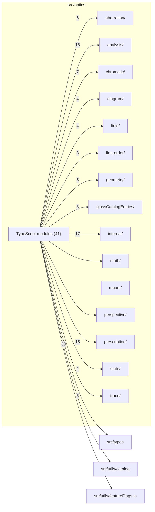

# src/optics

This folder pure optical engine, runtime-lens construction, tracing, analysis, projection, glass, mount rendering, and diagram geometry.

Generated `readme.md` and `improvementsuggestions.md` files are intentionally omitted from the per-file inventory so this document stays focused on source relationships.

## Relationship Diagram

```mermaid
flowchart LR
  subgraph n_src_optics["src/optics"]
    n_src_optics_src_optics_aberration["aberration/"]
    n_src_optics_src_optics_analysis["analysis/"]
    n_src_optics_src_optics_chromatic["chromatic/"]
    n_src_optics_src_optics_diagram["diagram/"]
    n_src_optics_src_optics_field["field/"]
    n_src_optics_src_optics_first_order["first-order/"]
    n_src_optics_src_optics_geometry["geometry/"]
    n_src_optics_src_optics_glassCatalogEntries["glassCatalogEntries/"]
    n_src_optics_src_optics_internal["internal/"]
    n_src_optics_src_optics_math["math/"]
    n_src_optics_src_optics_mount["mount/"]
    n_src_optics_src_optics_perspective["perspective/"]
    n_src_optics_src_optics_prescription["prescription/"]
    n_src_optics_src_optics_state["state/"]
    n_src_optics_src_optics_trace["trace/"]
    n_src_optics_TypeScript_modules["TypeScript modules (41)"]
  end
  n_external_src_types["src/types"]
  n_external_src_utils_catalog["src/utils/catalog"]
  n_external_src_utils_featureFlags_ts["src/utils/featureFlags.ts"]
  n_src_optics_TypeScript_modules --> |30| n_external_src_types
  n_src_optics_TypeScript_modules --> |18| n_src_optics_src_optics_analysis
  n_src_optics_TypeScript_modules --> |17| n_src_optics_src_optics_internal
  n_src_optics_TypeScript_modules --> |15| n_src_optics_src_optics_prescription
  n_src_optics_TypeScript_modules --> |8| n_src_optics_src_optics_glassCatalogEntries
  n_src_optics_TypeScript_modules --> |7| n_src_optics_src_optics_chromatic
  n_src_optics_TypeScript_modules --> |6| n_src_optics_src_optics_aberration
  n_src_optics_TypeScript_modules --> |5| n_src_optics_src_optics_geometry
  n_src_optics_TypeScript_modules --> |5| n_src_optics_src_optics_trace
  n_src_optics_TypeScript_modules --> |4| n_src_optics_src_optics_diagram
  n_src_optics_TypeScript_modules --> |4| n_src_optics_src_optics_field
  n_src_optics_TypeScript_modules --> |3| n_src_optics_src_optics_first_order
  n_src_optics_TypeScript_modules --> |2| n_src_optics_src_optics_state
  n_src_optics_TypeScript_modules --> n_external_src_utils_catalog
  n_src_optics_TypeScript_modules --> n_external_src_utils_featureFlags_ts
  n_src_optics_TypeScript_modules --> n_src_optics_src_optics_math
  n_src_optics_TypeScript_modules --> n_src_optics_src_optics_perspective
```

## Directory Overview

- Direct source files: 41
- Direct subfolders: 15
- Main outbound areas: src/types (30), src/optics/analysis (18), src/optics/internal (17), src/optics/prescription (15), src/optics/compat.ts (11), src/optics/glassCatalogEntries (8), src/optics/optics.ts (8), src/optics/chromatic (7), +31 more
- External consumers: src/benchmarks, src/comparison, src/components/controls, src/components/diagram, src/components/display, src/components/hooks, src/components/layout, src/optics/aberration, +15 more

## Subfolders

| Folder | Role |
| --- | --- |
| [aberration/](aberration/readme.md) | engine-native aberration analysis primitives and shared aberration types |
| [analysis/](analysis/readme.md) | prepared-state analysis adapters and grouped analysis facades |
| [chromatic/](chromatic/readme.md) | chromatic channel, trace, dispersion, and quality helpers |
| [diagram/](diagram/readme.md) | pure SVG-ready diagram geometry helpers used by React diagram layers |
| [field/](field/readme.md) | engine-native field geometry, chief-ray solving, projection, and launch helpers |
| [first-order/](first-order/readme.md) | first-order optical calculations for cardinals, pupils, f-number, focus breathing, and system matrices |
| [geometry/](geometry/readme.md) | the single implementation of surface sag, slope, and profiles, with the profile normal, conic domain, and slope bound, and the ray-surface intersection kernel with its roundoff envelopes and plane landings |
| [glassCatalogEntries/](glassCatalogEntries/readme.md) | src/optics/glassCatalogEntries source folder |
| [internal/](internal/readme.md) | private exact surface-tracing implementation details for the optics engine |
| [math/](math/readme.md) | low-level vector, numerical, and paraxial math |
| [mount/](mount/readme.md) | pure mount-diagram geometry, SVG document emission, validation, styling, and JSON helpers |
| [perspective/](perspective/readme.md) | src/optics/perspective source folder |
| [prescription/](prescription/readme.md) | lens prescription normalization, variable gaps, labels, groups, dispersion, interactions, and aspheric helpers |
| [state/](state/readme.md) | engine-native prepared optical state and cache helpers |
| [trace/](trace/readme.md) | exact tracing adapters, path planning, folded diagnostics, stop tracing, and aperture/interactions primitives |

## Files

| File | Role | Imports from | Imported by | Exports |
| --- | --- | --- | --- | --- |
| `aberrationAnalysis.ts` | Aberration Analysis helper module | src/optics/aberration (6) | src/components/display (20), src/optics/analysis | re-export *, computeSAProfile, computeSphericalAberration, computeSphericalAberrationBlurCharacter, computeComaAnalysis, computeComaPointCloudPreview, computeComaPreview, computeMeridionalComa, +12 more |
| `aperture.ts` | Aperture helper module | src/optics/compat.ts, src/types | src/comparison, src/components/hooks | fNumberAtStopdown |
| `apertureStop.ts` | Aperture Stop helper module | src/types | src/benchmarks, src/components/diagram, src/components/hooks, src/optics/field, src/optics/state | wideOpenStopAtZoom |
| `asphericComparison.ts` | Aspheric Comparison helper module | src/optics/geometry, src/types | src/components/display | DepartureSample, computeAsphericDeparture, computeDepartureProfile, computeBestFitSphereR, peakAbsDeparture, rmsDeparture, nearestSurfaceForClick |
| `buildLens.ts` | Build Lens module with default export | src/optics/prescription (4), src/optics/compat.ts, src/optics/runtimeLens.ts | src/components/hooks (2), src/utils/catalog (2), src/benchmarks, src/comparison | paraxialTrace, realTraceToStop, ingestLensV1, ingestTeleconverterV1, ingestLens, ingestTeleconverter, isV1File, toLensData, +3 more |
| `cameraLayout.ts` | Camera Layout helper module | src/types | src/optics/groupMovement.ts, src/optics/optics.ts | CameraAnchoredLayout, anchorLayoutToCamera |
| `cardinalElements.ts` | Cardinal Elements helper module | src/optics/compat.ts | src/components/diagram (3), src/benchmarks, src/components/hooks, src/components/layout | computeCardinalElements, computeCardinalElementsAtState, CardinalDistance, CardinalElements, CardinalPoint |
| `chiefRayDiagnostics.ts` | Chief Ray Diagnostics helper module | src/optics/compat.ts | none | getChiefRayDiagnostics, resetChiefRayDiagnostics, ChiefRayStatusCounts, ChiefRayStatus |
| `chromaticRayFanScaling.ts` | Chromatic Ray Fan Scaling helper module | src/types | src/components/diagram (2) | REFERENCE_LOCA_MM, REFERENCE_FAN_IMAGE_HEIGHT_SPREAD_MM, ChromaticBarResult, computeChromaticBarOffsets, computeLocaBarOffsets |
| `compat.ts` | Compat helper module | src/optics/analysis (13), src/optics/chromatic (4), src/optics/diagram (4), src/optics/field (3), src/optics/first-order (3), +6 more | src/components/display (15), src/components/hooks (2), src/components/layout (2), src/benchmarks, src/optics/aperture.ts, +7 more | buildLens2, engineLensFromRuntime, prepareRuntimeState, doLayout2, thick2, eflAtZoom2, epAtZoom2, fopenAtZoom2, +174 more |
| `constants.ts` | Constants helper module | src/optics/spectralLines.ts, src/types | src/optics/geometry (4), src/optics/internal, src/optics/math, src/optics/rayTrace.ts, src/optics/trace | VECTOR_EPSILON, INTERSECTION_TOLERANCE, INTERSECTION_MAX_ITERATIONS, INTERSECTION_BRACKET_SAMPLES, CHROMATIC_CHANNEL_WAVELENGTH_NM |
| `diagramGeometry.ts` | Diagram Geometry helper module | src/optics/compat.ts | src/benchmarks, src/components/diagram, src/components/hooks | computeElementRenderDiagnostics, computeElementShapes, computeStandaloneMirrorPaths, createCoordinateTransforms, DiagramPointTransform |
| `dispersion.ts` | Dispersion helper module | src/optics/glassCatalog.ts, src/types | src/components/diagram (7), src/optics/chromatic (3), src/components/display, src/components/layout, src/optics/prescription, +2 more | normalLinePgF, normalLinePdC, normalLinePeC, normalLinePgFPrime, abbeLineIndices, DispersionQuality, SurfaceIndexFn, SurfaceDispersion, +3 more |
| `distortionAnalysis.ts` | Distortion Analysis helper module | src/optics/optics.ts (2), src/optics/analysis, src/optics/projection.ts, src/optics/raySampling.ts, src/types | src/components/display (2), src/optics/analysis | DistortionSample, DistortionGridPoint, DistortionGridLine, DistortionFieldGridResult, computeDistortionCurve, computeDistortionFieldGrid |
| `fieldGeometry.ts` | Field Geometry helper module | src/optics/compat.ts | none | chiefRayImageHeight, chiefRayImageHeightAccurate, computeAnalysisFieldGeometryAtState, computeBoundingSphereLaunchRadiusMm, computeBoundingSphereVectorFieldLaunch, computeFieldGeometryAtState, conjugateK, entrancePupilAtState, +13 more |
| `focusDistance.ts` | Focus Distance helper module | src/types | src/comparison, src/components/controls, src/optics/analysis, src/optics/first-order, src/optics/layout.ts, +2 more | FOCUS_INFINITY_THRESHOLD, remapFocusDistance, closeFocusAtZoom |
| `foldedPathDisplay.ts` | Folded Path Display helper module | src/optics/optics.ts, src/optics/raySampling.ts, src/types | src/components/layout | foldedHitOrderLabelsForDisplay |
| `geometry.ts` | Geometry helper module | src/optics/geometry | src/components/display | DEFAULT_MAX_RIM_ANGLE_DEG, FLAT_R_THRESHOLD, MAX_RIM_SLOPE_TAN, conicPolySag, sag, sagSlopeRaw |
| `glassCatalog.ts` | Glass Catalog helper module | src/optics/glassCatalogTypes.ts (2), src/optics/spectralLines.ts (2), src/optics/glassCatalogAliases.ts, src/optics/glassCatalogData.ts, src/types | src/optics/chromatic, src/optics/dispersion.ts, src/optics/types.ts | GlassEntry, LINE_NM, GLASS_ND_TOLERANCE, GLASS_CATALOG_ND_TOLERANCE, GLASS_CATALOG_VD_TOLERANCE, GLASS_VD_TOLERANCE, CatalogGlassCompatibility, GlassResolutionMatchSource, +16 more |
| `glassCatalogAliases.ts` | Glass Catalog Aliases helper module | none | src/optics/glassCatalog.ts | GlassAliasKind, GlassAliasRecord, ALIAS_RECORDS, ALIASES |
| `glassCatalogData.ts` | Glass Catalog Data helper module | src/optics/glassCatalogEntries (8), src/optics/glassCatalogTypes.ts (2) | src/optics/glassCatalog.ts | GlassEntry, DUPLICATE_CODE6_PRECEDENCE, RAW_CATALOG |
| `glassCatalogTypes.ts` | Glass Catalog Types helper module | none | src/optics/glassCatalogEntries (8), src/optics/glassCatalog.ts, src/optics/glassCatalogData.ts | GlassEntry |
| `groupMovement.ts` | Group Movement helper module | src/types (2), src/optics/cameraLayout.ts, src/optics/optics.ts | src/comparison (2), src/components/controls, src/components/display, src/optics/analysis, src/optics/publishedStations.ts | LensMovementGroup, GroupMovementPoint, GroupMovementSeries, GroupMovementAvailability, GroupMovementProfile, getGroupMovementAvailability, isGroupMovementModeAvailable, firstAvailableGroupMovementMode, +2 more |
| `layout.ts` | Layout helper module | src/optics/focusDistance.ts (2), src/optics/internal (2), src/optics/geometry, src/types | src/optics/aberration (4), src/optics/analysis (4), src/optics/first-order (2), src/optics/chromatic, src/optics/optics.ts, +4 more | SVG_PATH_SUBDIVISIONS, FOCUS_INFINITY_THRESHOLD, renderSag, sagSlope, gapTrimHeight, slopeTrimHeight, thick, doLayout, +13 more |
| `lensMovement.ts` | Lens Movement helper module | src/optics/perspective, src/types | src/optics/perspective (4), src/comparison (2), src/benchmarks, src/components/controls, src/components/diagram, +3 more | LensMovementState, ResolvedLensMovement, LensMovementTransform, MOVEMENT_SHIFT_ENVELOPE_MM, MOVEMENT_TILT_ENVELOPE_DEG, isMovementAxisEnabled, ZERO_LENS_MOVEMENT, perspectiveControlSteps, +5 more |
| `mtf.ts` | Mtf helper module | src/optics/analysis (3) | src/components/display, src/components/hooks | assessMtfSupport, MTF_FIELDS, MTF_FREQUENCIES, MTF_PHOTOPIC_LINES, resolveMtfSpectrum, computeMtf, computeMtfSteps, resolveMtfGeometry, +3 more |
| `optics.ts` | Optics helper module | src/optics/compat.ts (4), src/optics/cameraLayout.ts, src/optics/layout.ts, src/optics/opticsFormat.ts, src/optics/rayTrace.ts, +2 more | src/components/display (12), src/optics/analysis (8), src/components/hooks (6), src/comparison (3), src/components/controls (3), +8 more | traceChiefRelativeSkewRay, traceChiefRelativeSkewRayChromatic, anchorLayoutToCamera, CameraAnchoredLayout, FOCUS_INFINITY_THRESHOLD, SVG_PATH_SUBDIVISIONS, bAtZoom, epZRelStopAtZoom, +70 more |
| `opticsFormat.ts` | Optics Format helper module | src/optics/focusDistance.ts, src/optics/layout.ts, src/types | src/optics/optics.ts | formatFNumber, marketedApertureNote, formatDist, formatPetzvalRadius |
| `projection.ts` | Projection helper module | src/optics/compat.ts | src/components/controls (2), src/components/hooks, src/components/layout, src/optics/distortionAnalysis.ts, src/optics/pupilAberration.ts, +1 more | ABSOLUTE_HALF_FIELD_CEILING, MAX_FIELD_LAUNCH_DEG, TRACING_SAFETY_FACTOR, boundingSphereLaunchVector, distortionProjectionReferenceForLens, fisheyeProjectionFocalLengthAtZoom, fisheyeProjectionMaxTraceFieldAtZoom, isFisheyeProjection, +16 more |
| `publishedStations.ts` | Published Stations helper module | src/optics/focusDistance.ts, src/optics/groupMovement.ts, src/optics/internal, src/types | src/components/controls (2), src/components/hooks | STATION_COORDINATE_TOLERANCE, PublishedStationSource, PublishedStationCoordinate, PublishedStationGrid, PublishedZoomStation, PublishedFocusStation, PublishedStationLimitKind, PublishedStationLimit, +8 more |
| `pupilAberration.ts` | Pupil Aberration helper module | src/optics/internal (3), src/optics/optics.ts (2), src/optics/layout.ts, src/optics/projection.ts, src/types | src/components/display, src/optics/analysis | PupilAberrationSample, PupilAberrationProfile, ExitPupilAberrationSample, ExitPupilAberrationProfile, PUPIL_ABERRATION_SAMPLE_COUNT, computePupilAberrationProfile, computeExitPupilAberrationProfile, BothPupilAberrationProfiles, +1 more |
| `raySampling.ts` | Ray Sampling helper module | src/types (2), src/optics/stopObstruction.ts | src/components/hooks (3), src/benchmarks, src/components/layout, src/optics/distortionAnalysis.ts, src/optics/field, +2 more | isHeavyLensForRayWork, rayFractionsForDensity, obstructionAwareRayFractionsForDensity, raySampleCountForDensity |
| `rayTrace.ts` | Ray Trace helper module | src/optics/chromatic (3), src/optics/internal (2), src/optics/constants.ts, src/optics/layout.ts, src/optics/trace, +1 more | src/optics/aberration (6), src/optics/perspective (2), src/optics/optics.ts | SkewRayTraceResult, VectorRayTraceInput, SkewImagePlaneIntercept, OrthogonalPupilSample, CircularPupilSample, DEFAULT_ORTHOGONAL_PUPIL_FAN_SAMPLE_COUNT, DEFAULT_CIRCULAR_PUPIL_RING_SAMPLES, wavelengthNd, +13 more |
| `runtimeLens.ts` | Runtime Lens module with default export | src/optics/internal (4), src/optics/dispersion.ts, src/optics/field, src/optics/geometry, src/optics/math, +4 more | src/optics/buildLens.ts, src/optics/compat.ts, src/optics/prescription | assertValidLensData, default, buildLens, paraxialTrace, realTraceToStop |
| `spectralLines.ts` | Spectral Lines helper module | none | src/optics/analysis (2), src/optics/chromatic (2), src/optics/constants.ts, src/optics/glassCatalog.ts, src/optics/math | LINE_NM |
| `stopObstruction.ts` | Stop Obstruction helper module | src/types | src/optics/optics.ts, src/optics/raySampling.ts | stopInnerBlockedSemiDiameter |
| `teleconverter.ts` | Teleconverter helper module | src/optics/prescription (2), src/optics/validateTeleconverterData.ts | src/components/diagram, src/utils/catalog | attachTeleconverter, TeleconverterAttachError, teleconverterGroupLabel, teleconverterSurfaceLabel, MIN_TELECONVERTER_GAP_MM, TELECONVERTER_LABEL_PREFIX, teleconverterCompatibility, teleconverterGeometry, +1 more |
| `types.ts` | Shared TypeScript types | src/optics/dispersion.ts, src/optics/glassCatalog.ts, src/optics/trace, src/types | src/optics/analysis (21), src/optics/perspective (20), src/components/display (14), src/optics/trace (11), src/optics/geometry (6), +10 more | Vec3, Ray3, Plane3, SagSlope, SurfaceProfile, CompiledSurfaceInteraction, CompiledRadialPhaseTerm, CompiledDiffractivePhase, +17 more |
| `validateLensData.ts` | Validate Lens Data module with default export | src/optics/internal (4), src/optics/prescription (3), src/types (2), src/optics/geometry, src/utils/catalog | src/optics/prescription, src/optics/runtimeLens.ts, src/optics/validateTeleconverterData.ts, src/utils/state | validateRearPlates, validateLensMounts, LENS_KEY_PATTERN, default, validateLensData |
| `validateTeleconverterData.ts` | Validate Teleconverter Data module with default export | src/optics/prescription (4), src/types (2), src/optics/internal, src/optics/validateLensData.ts | src/optics/teleconverter.ts | default, validateTeleconverterData |
| `vignetteAnalysis.ts` | Vignette Analysis helper module | src/optics/optics.ts (2), src/optics/analysis, src/optics/projection.ts, src/optics/raySampling.ts, src/types | src/components/display, src/optics/analysis | VignettingSample, computeVignettingCurve |
