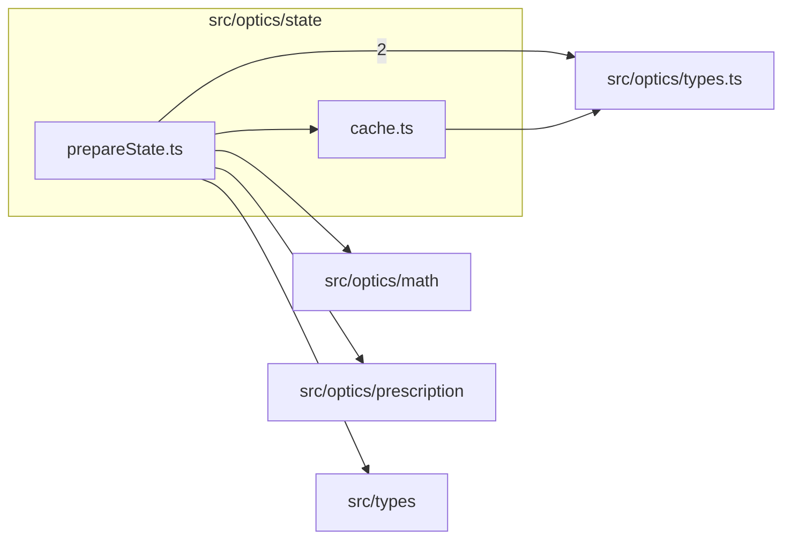

# src/optics/state

This folder engine-native prepared optical state and cache helpers.

Generated `readme.md` and `improvementsuggestions.md` files are intentionally omitted from the per-file inventory so this document stays focused on source relationships.

## Relationship Diagram

## Directory Overview

- Direct source files: 2
- Direct subfolders: 0
- Main outbound areas: src/optics/types.ts (3), same folder, src/optics/math, src/optics/prescription, src/types
- External consumers: src/optics/compat.ts, src/optics/diagram, src/optics/field, src/optics/first-order, src/optics/trace

## Files

| File | Role | Imports from | Imported by | Exports |
| --- | --- | --- | --- | --- |
| `cache.ts` | Cache helper module | src/optics/types.ts | same folder, src/optics/compat.ts | PreparedStateCache, createPreparedStateCache |
| `prepareState.ts` | Prepare State helper module | src/optics/types.ts (2), same folder, src/optics/math, src/optics/prescription, src/types | src/optics/first-order (2), src/optics/compat.ts, src/optics/diagram, src/optics/field, src/optics/trace | PrepareStateOptions, preparedStateCacheKey, prepareState |

