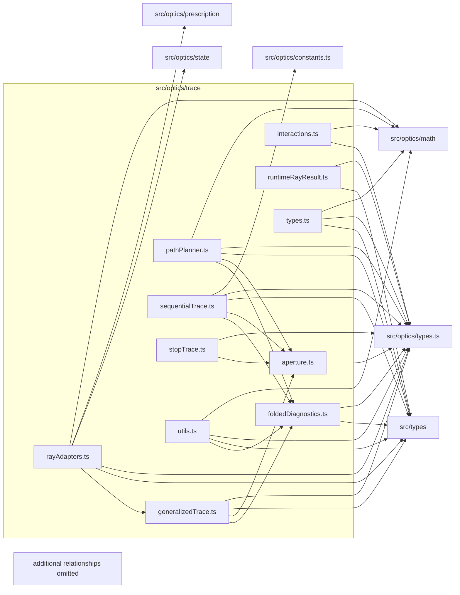

# src/optics/trace

This folder exact tracing adapters, path planning, folded diagnostics, stop tracing, and aperture/interactions primitives.

Generated `readme.md` and `improvementsuggestions.md` files are intentionally omitted from the per-file inventory so this document stays focused on source relationships.

## Relationship Diagram

## Directory Overview

- Direct source files: 11
- Direct subfolders: 0
- Main outbound areas: same folder (27), src/optics/types.ts (11), src/types (8), src/optics/math (5), src/optics/constants.ts, src/optics/prescription, src/optics/state
- External consumers: src/optics/aberration, src/optics/analysis, src/optics/chromatic, src/optics/compat.ts, src/optics/field, src/optics/first-order

## Files

| File | Role | Imports from | Imported by | Exports |
| --- | --- | --- | --- | --- |
| `aperture.ts` | Aperture helper module | src/optics/types.ts | same folder (4) | ApertureState, ApertureEvaluation, evaluateAperture, isInsideActiveAperture |
| `foldedDiagnostics.ts` | Folded Diagnostics helper module | same folder, src/optics/types.ts, src/types | same folder (4) | surfaceLabel, pushClipEvent, buildTraceDiagnostics |
| `generalizedTrace.ts` | Generalized Trace helper module | same folder (6), src/optics/types.ts, src/types | same folder (2) | shouldUseGeneralizedTrace, traceGeneralized |
| `interactions.ts` | Interactions helper module | src/optics/math, src/optics/types.ts | same folder (3) | IncidentSide, incidentSideFor, isSurfaceSideActive, reflectedDirection, refractedDirection, orientedRefractionNormal, resolvedNextIndex, advanceOrigin |
| `pathPlanner.ts` | Path Planner helper module | same folder (3), src/optics/math, src/optics/types.ts, src/types | same folder (2) | SurfaceHitCandidate, ImagePlaneIntersection, sequentialSurfaceMaxT, targetedSurfaceMaxT, intersectStateSurface, intersectImagePlane, findNearestGeneralizedSurfaceHit, generalizedHitTolerance, +1 more |
| `rayAdapters.ts` | Ray Adapters helper module | same folder (4), src/optics/math, src/optics/prescription, src/optics/state, src/optics/types.ts, +1 more | src/optics/aberration (2), src/optics/analysis, src/optics/chromatic, src/optics/compat.ts, src/optics/field, +1 more | VectorRayTraceInput2, traceEngineRay2, traceRay2, traceRayChromatic2, traceSkewRay2, traceSkewRayChromatic2, traceRayVector2, traceRayVectorChromatic2, +2 more |
| `runtimeRayResult.ts` | Runtime Ray Result helper module | same folder, src/optics/types.ts, src/types | same folder | RuntimeSkewRayTraceResult, engineTraceToRuntimeRayResult, engineTraceToRuntimeSkewResult, vectorLeadPoint |
| `sequentialTrace.ts` | Sequential Trace helper module | same folder (6), src/optics/constants.ts, src/optics/types.ts, src/types | same folder | traceSequential |
| `stopTrace.ts` | Stop Trace helper module | same folder (4), src/optics/types.ts | src/optics/compat.ts, src/optics/field | StopTraceOptions, TraceToStopResult, traceToStopViaGeneralized2 |
| `types.ts` | Shared TypeScript types | src/optics/math, src/optics/types.ts, src/types | same folder (7), src/optics/chromatic, src/optics/field | TraceFailureReason, TraceHit, EngineTraceResult, TraceOptions, TraceDiagnosticsInput |
| `utils.ts` | Utils helper module | same folder (2), src/optics/math, src/optics/types.ts, src/types | same folder (3) | directionSlopes, projectCoordinateToZ, normalizeTraceDirection, finalizeTraceResult, clampTraceCount, resolveReturnVertexIndex |

