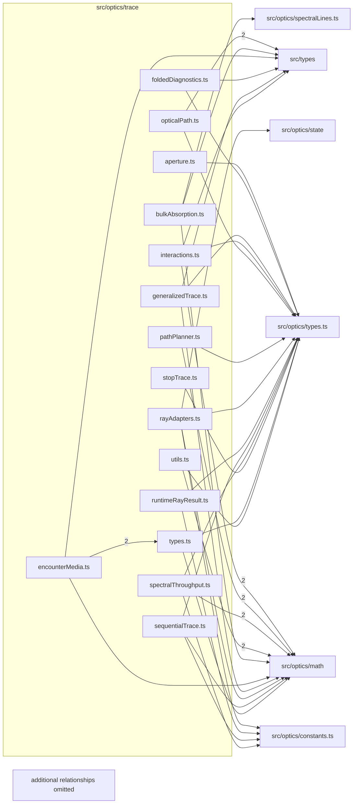

# src/optics/trace

This folder exact tracing adapters, path planning, folded diagnostics, stop tracing, and aperture/interactions primitives.

Generated `readme.md` and `improvementsuggestions.md` files are intentionally omitted from the per-file inventory so this document stays focused on source relationships.

## Relationship Diagram

```mermaid
flowchart LR
  subgraph n_src_optics_trace["src/optics/trace"]
    n_src_optics_trace_src_optics_trace_aperture_ts["aperture.ts"]
    n_src_optics_trace_src_optics_trace_bulkAbsorption_ts["bulkAbsorption.ts"]
    n_src_optics_trace_src_optics_trace_encounterMedia_ts["encounterMedia.ts"]
    n_src_optics_trace_src_optics_trace_foldedDiagnostics_ts["foldedDiagnostics.ts"]
    n_src_optics_trace_src_optics_trace_generalizedTrace_ts["generalizedTrace.ts"]
    n_src_optics_trace_src_optics_trace_interactions_ts["interactions.ts"]
    n_src_optics_trace_src_optics_trace_opticalPath_ts["opticalPath.ts"]
    n_src_optics_trace_src_optics_trace_pathPlanner_ts["pathPlanner.ts"]
    n_src_optics_trace_src_optics_trace_rayAdapters_ts["rayAdapters.ts"]
    n_src_optics_trace_src_optics_trace_runtimeRayResult_ts["runtimeRayResult.ts"]
    n_src_optics_trace_src_optics_trace_sequentialTrace_ts["sequentialTrace.ts"]
    n_src_optics_trace_src_optics_trace_spectralThroughput_ts["spectralThroughput.ts"]
    n_src_optics_trace_src_optics_trace_stopTrace_ts["stopTrace.ts"]
    n_src_optics_trace_src_optics_trace_types_ts["types.ts"]
    n_src_optics_trace_src_optics_trace_utils_ts["utils.ts"]
  end
  n_external_src_optics_math["src/optics/math"]
  n_external_src_types["src/types"]
  n_external_src_optics_constants_ts["src/optics/constants.ts"]
  n_external_src_optics_spectralLines_ts["src/optics/spectralLines.ts"]
  n_external_src_optics_state["src/optics/state"]
  n_external_src_optics_types_ts["src/optics/types.ts"]
  n_src_optics_trace_src_optics_trace_interactions_ts --> |2| n_external_src_optics_math
  n_src_optics_trace_src_optics_trace_pathPlanner_ts --> |2| n_external_src_optics_math
  n_src_optics_trace_src_optics_trace_spectralThroughput_ts --> |2| n_external_src_optics_math
  n_src_optics_trace_src_optics_trace_utils_ts --> |2| n_external_src_optics_math
  n_src_optics_trace_src_optics_trace_opticalPath_ts --> |2| n_external_src_types
  n_src_optics_trace_src_optics_trace_encounterMedia_ts --> |2| n_src_optics_trace_src_optics_trace_types_ts
  n_src_optics_trace_src_optics_trace_rayAdapters_ts --> n_external_src_optics_constants_ts
  n_src_optics_trace_src_optics_trace_runtimeRayResult_ts --> n_external_src_optics_constants_ts
  n_src_optics_trace_src_optics_trace_sequentialTrace_ts --> n_external_src_optics_constants_ts
  n_src_optics_trace_src_optics_trace_spectralThroughput_ts --> n_external_src_optics_constants_ts
  n_src_optics_trace_src_optics_trace_bulkAbsorption_ts --> n_external_src_optics_math
  n_src_optics_trace_src_optics_trace_encounterMedia_ts --> n_external_src_optics_math
  n_src_optics_trace_src_optics_trace_generalizedTrace_ts --> n_external_src_optics_math
  n_src_optics_trace_src_optics_trace_rayAdapters_ts --> n_external_src_optics_math
  n_src_optics_trace_src_optics_trace_sequentialTrace_ts --> n_external_src_optics_math
  n_src_optics_trace_src_optics_trace_types_ts --> n_external_src_optics_math
  n_src_optics_trace_src_optics_trace_bulkAbsorption_ts --> n_external_src_optics_spectralLines_ts
  n_src_optics_trace_src_optics_trace_rayAdapters_ts --> n_external_src_optics_state
  n_src_optics_trace_src_optics_trace_aperture_ts --> n_external_src_optics_types_ts
  n_src_optics_trace_src_optics_trace_foldedDiagnostics_ts --> n_external_src_optics_types_ts
  n_src_optics_trace_src_optics_trace_generalizedTrace_ts --> n_external_src_optics_types_ts
  n_src_optics_trace_src_optics_trace_interactions_ts --> n_external_src_optics_types_ts
  n_src_optics_trace_src_optics_trace_opticalPath_ts --> n_external_src_optics_types_ts
  n_src_optics_trace_src_optics_trace_pathPlanner_ts --> n_external_src_optics_types_ts
  n_src_optics_trace_src_optics_trace_rayAdapters_ts --> n_external_src_optics_types_ts
  n_src_optics_trace_src_optics_trace_runtimeRayResult_ts --> n_external_src_optics_types_ts
  n_src_optics_trace_src_optics_trace_sequentialTrace_ts --> n_external_src_optics_types_ts
  n_src_optics_trace_src_optics_trace_spectralThroughput_ts --> n_external_src_optics_types_ts
  n_src_optics_trace_src_optics_trace_stopTrace_ts --> n_external_src_optics_types_ts
  n_src_optics_trace_src_optics_trace_types_ts --> n_external_src_optics_types_ts
  n_src_optics_trace_src_optics_trace_utils_ts --> n_external_src_optics_types_ts
  n_src_optics_trace_src_optics_trace_bulkAbsorption_ts --> n_external_src_types
  n_src_optics_trace_src_optics_trace_encounterMedia_ts --> n_external_src_types
  n_src_optics_trace_src_optics_trace_foldedDiagnostics_ts --> n_external_src_types
  n_src_optics_trace_src_optics_trace_generalizedTrace_ts --> n_external_src_types
  n_src_optics_trace_src_optics_trace_interactions_ts --> n_external_src_types
  n_src_optics_trace_truncated["additional relationships omitted"]
```

## Directory Overview

- Direct source files: 15
- Direct subfolders: 0
- Main outbound areas: same folder (39), src/optics/math (14), src/types (14), src/optics/types.ts (13), src/optics/constants.ts (4), src/optics/spectralLines.ts, src/optics/state
- External consumers: src/optics/aberration, src/optics/analysis, src/optics/chromatic, src/optics/compat.ts, src/optics/field, src/optics/first-order, src/optics/internal, src/optics/optics.ts, +2 more

## Files

| File | Role | Imports from | Imported by | Exports |
| --- | --- | --- | --- | --- |
| `aperture.ts` | Aperture helper module | src/optics/types.ts | same folder (4) | ApertureState, ApertureEvaluation, evaluateAperture, isInsideActiveAperture |
| `bulkAbsorption.ts` | Bulk Absorption helper module | same folder, src/optics/math, src/optics/spectralLines.ts, src/types | same folder (2), src/optics/perspective, src/optics/rayTrace.ts | bulkAbsorptionCoefficient, bulkTransmissionForTrace |
| `encounterMedia.ts` | Encounter Media helper module | same folder (2), src/optics/math, src/types | same folder (3) | MediumEncounterHit, mediumAfterEncounter |
| `foldedDiagnostics.ts` | Folded Diagnostics helper module | same folder, src/optics/types.ts, src/types | same folder (4) | surfaceLabel, pushClipEvent, buildTraceDiagnostics |
| `generalizedTrace.ts` | Generalized Trace helper module | same folder (6), src/optics/math, src/optics/types.ts, src/types | same folder (2), src/optics/analysis, src/optics/perspective | shouldUseGeneralizedTrace, traceGeneralized |
| `interactions.ts` | Interactions helper module | src/optics/math (2), src/optics/types.ts, src/types | same folder (3), src/optics/internal | IncidentSide, incidentSideFor, isSurfaceSideActive, reflectedDirection, refractedDirection, phaseRefractedDirection, RefractiveInteractionFailure, RefractiveInteractionResult, +4 more |
| `opticalPath.ts` | Optical Path helper module | same folder (3), src/types (2), src/optics/types.ts | src/optics/analysis, src/optics/optics.ts | opticalPathForTrace |
| `pathPlanner.ts` | Path Planner helper module | same folder (3), src/optics/math (2), src/optics/types.ts, src/types | same folder (2) | SurfaceHitCandidate, ImagePlaneIntersection, sequentialSurfaceMaxT, targetedSurfaceMaxT, intersectStateSurface, intersectImagePlane, findNearestGeneralizedSurfaceHit, generalizedHitTolerance, +1 more |
| `rayAdapters.ts` | Ray Adapters helper module | same folder (4), src/optics/constants.ts, src/optics/math, src/optics/state, src/optics/types.ts, +1 more | src/optics/aberration (2), same folder, src/optics/analysis, src/optics/chromatic, src/optics/compat.ts, +3 more | VectorRayTraceInput2, traceEngineRay2, traceRay2, traceRayChromatic2, traceSkewRay2, traceSkewRayChromatic2, traceRayVector2, traceRayVectorChromatic2, +3 more |
| `runtimeRayResult.ts` | Runtime Ray Result helper module | same folder (2), src/optics/constants.ts, src/optics/types.ts, src/types | same folder | RuntimeSkewRayTraceResult, engineTraceToRuntimeRayResult, engineTraceToRuntimeSkewResult, vectorLeadPoint |
| `sequentialTrace.ts` | Sequential Trace helper module | same folder (6), src/optics/constants.ts, src/optics/math, src/optics/types.ts, src/types | same folder | traceSequential |
| `spectralThroughput.ts` | Spectral Throughput helper module | same folder (5), src/optics/math (2), src/optics/constants.ts, src/optics/types.ts, src/types | src/optics/analysis, src/optics/optics.ts | dielectricReflectance, throughputForTrace, traceSpectralThroughput |
| `stopTrace.ts` | Stop Trace helper module | same folder (4), src/optics/types.ts | src/optics/compat.ts, src/optics/field | StopTraceOptions, TraceToStopResult, traceToStopViaGeneralized2 |
| `types.ts` | Shared TypeScript types | src/optics/math, src/optics/types.ts, src/types | same folder (10), src/optics/field, src/optics/perspective | TraceFailureReason, TraceHit, EngineTraceResult, TraceOptions, TraceDiagnosticsInput, MediumEncounterHit |
| `utils.ts` | Utils helper module | same folder (2), src/optics/math (2), src/optics/types.ts, src/types | same folder (5), src/optics/perspective | sensorPointForTrace, directionSlopes, projectCoordinateToZ, normalizeTraceDirection, finalizeTraceResult, clampTraceCount, resolveReturnVertexIndex |
