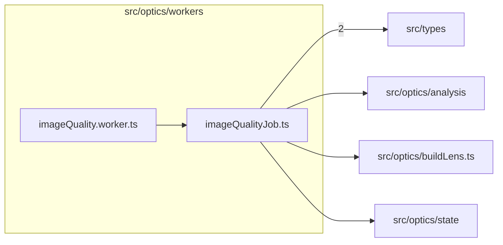

# src/optics/workers

This folder src/optics/workers source folder.

Generated `readme.md` and `improvementsuggestions.md` files are intentionally omitted from the per-file inventory so this document stays focused on source relationships.

## Relationship Diagram

## Directory Overview

- Direct source files: 2
- Direct subfolders: 0
- Main outbound areas: src/types (2), same folder, src/optics/analysis, src/optics/buildLens.ts, src/optics/state
- External consumers: src/components/display

## Files

| File | Role | Imports from | Imported by | Exports |
| --- | --- | --- | --- | --- |
| `imageQuality.worker.ts` | Image Quality helper module | same folder | none | none |
| `imageQualityJob.ts` | Image Quality Job helper module | src/types (2), src/optics/analysis, src/optics/buildLens.ts, src/optics/state | same folder, src/components/display | ImageQualityJobRequest, ImageQualityJobResponse, computeImageQualityJob, ImageQualityWorkerScope, installImageQualityWorker |
