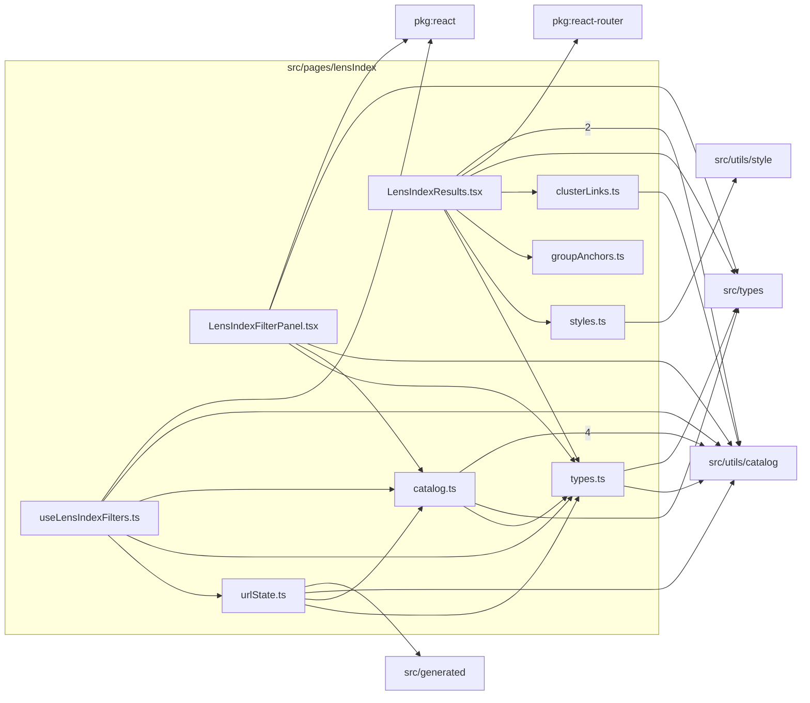

# src/pages/lensIndex

This folder lens library catalog filtering, URL state, grouping, results, and filter-panel UI.

Generated `readme.md` and `improvementsuggestions.md` files are intentionally omitted from the per-file inventory so this document stays focused on source relationships.

## Relationship Diagram

## Directory Overview

- Direct source files: 9
- Direct subfolders: 0
- Main outbound areas: same folder (12), src/utils/catalog (11), src/types (4), package:react (2), package:react-router, src/generated, src/utils/style
- External consumers: src/components/layout, src/pages/FormatPage.tsx, src/pages/FormatsIndexPage.tsx, src/pages/LensIndexPage.tsx, src/pages/MountPage.tsx, src/pages/MountsIndexPage.tsx

## Files

| File | Role | Imports from | Imported by | Exports |
| --- | --- | --- | --- | --- |
| `catalog.ts` | Catalog helper module | src/utils/catalog (4), same folder, src/types | same folder (3), src/components/layout, src/pages/FormatPage.tsx, src/pages/FormatsIndexPage.tsx, src/pages/LensIndexPage.tsx, +2 more | buildFilterBounds, defaultCustomFilter, buildMakerOptions, buildMountOptions, buildImageFormatOptions, matchesCustomFilter, hasActiveCustomFilters, groupByMaker, +17 more |
| `clusterLinks.ts` | Cluster Links helper module | src/utils/catalog | same folder, src/pages/FormatPage.tsx, src/pages/LensIndexPage.tsx, src/pages/MountPage.tsx | LensLibraryBreadcrumbContext, lensLinkFromLibrary, lensLinkFromMount, lensLinkFromFormat |
| `groupAnchors.ts` | Group Anchors helper module | none | same folder, src/pages/LensIndexPage.tsx | slugifyGroupKey, makerGroupAnchorId, mountGroupAnchorId, formatGroupAnchorId, yearGroupAnchorId, focalSectionAnchorId, focalSubGroupAnchorId |
| `LensIndexFilterPanel.tsx` | Route-level React page | same folder (2), package:react, src/types, src/utils/catalog | src/pages/LensIndexPage.tsx | default, LensIndexFilterPanel |
| `LensIndexResults.tsx` | Route-level React page | same folder (4), src/utils/catalog (2), package:react-router, src/types | src/pages/LensIndexPage.tsx | default, LensIndexResults |
| `styles.ts` | Styles helper module | src/utils/style | same folder, src/pages/LensIndexPage.tsx | H1_STYLE, LENS_LINK_BASE_STYLE, PAGE_BASE_STYLE, SECTION_HEADING_BASE_STYLE |
| `types.ts` | Shared TypeScript types | src/types, src/utils/catalog | same folder (5), src/pages/LensIndexPage.tsx | GroupMode, LensIndexViewMode, CatalogLensEntry, MakerOption, MountOption, ImageFormatOption, MakerGroup, MountGroup, +7 more |
| `urlState.ts` | Url State helper module | same folder (2), src/generated, src/utils/catalog | same folder, src/components/layout, src/pages/LensIndexPage.tsx | LensIndexUrlState, parseLensIndexViewMode, parseLensIndexUrlState, serializeLensIndexUrlState, isSameCustomFilter, isValidLensLibraryReturnPath |
| `useLensIndexFilters.ts` | React hook module | same folder (3), package:react, src/utils/catalog | src/pages/LensIndexPage.tsx | NumericFilterConfig, default, useLensIndexFilters |

