# src/pages

This folder route-level React pages and page-specific lens-index feature module.

Generated `readme.md` and `improvementsuggestions.md` files are intentionally omitted from the per-file inventory so this document stays focused on source relationships.

## Relationship Diagram

```mermaid
flowchart LR
  subgraph n_src_pages["src/pages"]
    n_src_pages_src_pages_lensIndex["lensIndex/"]
    n_src_pages_src_pages_ArticlePage_tsx["ArticlePage.tsx"]
    n_src_pages_src_pages_ArticlesPage_tsx["ArticlesPage.tsx"]
    n_src_pages_src_pages_ComparePage_tsx["ComparePage.tsx"]
    n_src_pages_src_pages_FormatPage_tsx["FormatPage.tsx"]
    n_src_pages_src_pages_FormatsIndexPage_tsx["FormatsIndexPage.tsx"]
    n_src_pages_src_pages_HomePage_tsx["HomePage.tsx"]
    n_src_pages_src_pages_LensIndexPage_tsx["LensIndexPage.tsx"]
    n_src_pages_src_pages_LensPage_tsx["LensPage.tsx"]
    n_src_pages_src_pages_MakerPage_tsx["MakerPage.tsx"]
    n_src_pages_src_pages_MakersIndexPage_tsx["MakersIndexPage.tsx"]
    n_src_pages_src_pages_MountPage_tsx["MountPage.tsx"]
    n_src_pages_src_pages_MountsIndexPage_tsx["MountsIndexPage.tsx"]
    n_src_pages_src_pages_NotFoundPage_tsx["NotFoundPage.tsx"]
    n_src_pages_src_pages_UpdatesPage_tsx["UpdatesPage.tsx"]
  end
  n_external_src_components_homepage["src/components/homepage"]
  n_external_src_utils_catalog["src/utils/catalog"]
  n_external_pkg_react["pkg:react"]
  n_external_src_components_content["src/components/content"]
  n_external_pkg_react_router["pkg:react-router"]
  n_src_pages_src_pages_LensIndexPage_tsx --> |10| n_src_pages_src_pages_lensIndex
  n_src_pages_src_pages_HomePage_tsx --> |5| n_external_src_components_homepage
  n_src_pages_src_pages_MakerPage_tsx --> |5| n_external_src_utils_catalog
  n_src_pages_src_pages_FormatPage_tsx --> |3| n_external_src_utils_catalog
  n_src_pages_src_pages_MakersIndexPage_tsx --> |3| n_external_src_utils_catalog
  n_src_pages_src_pages_MountPage_tsx --> |3| n_external_src_utils_catalog
  n_src_pages_src_pages_ArticlePage_tsx --> |2| n_external_pkg_react
  n_src_pages_src_pages_ArticlesPage_tsx --> |2| n_external_src_components_content
  n_src_pages_src_pages_LensIndexPage_tsx --> |2| n_external_src_components_content
  n_src_pages_src_pages_MakerPage_tsx --> |2| n_external_src_components_content
  n_src_pages_src_pages_MountPage_tsx --> |2| n_external_src_components_content
  n_src_pages_src_pages_ComparePage_tsx --> |2| n_external_src_utils_catalog
  n_src_pages_src_pages_FormatsIndexPage_tsx --> |2| n_external_src_utils_catalog
  n_src_pages_src_pages_HomePage_tsx --> |2| n_external_src_utils_catalog
  n_src_pages_src_pages_LensIndexPage_tsx --> |2| n_external_src_utils_catalog
  n_src_pages_src_pages_LensPage_tsx --> |2| n_external_src_utils_catalog
  n_src_pages_src_pages_MountsIndexPage_tsx --> |2| n_external_src_utils_catalog
  n_src_pages_src_pages_UpdatesPage_tsx --> |2| n_external_src_utils_catalog
  n_src_pages_src_pages_FormatPage_tsx --> |2| n_src_pages_src_pages_lensIndex
  n_src_pages_src_pages_MountPage_tsx --> |2| n_src_pages_src_pages_lensIndex
  n_src_pages_src_pages_ArticlesPage_tsx --> n_external_pkg_react
  n_src_pages_src_pages_HomePage_tsx --> n_external_pkg_react
  n_src_pages_src_pages_LensIndexPage_tsx --> n_external_pkg_react
  n_src_pages_src_pages_UpdatesPage_tsx --> n_external_pkg_react
  n_src_pages_src_pages_ArticlePage_tsx --> n_external_pkg_react_router
  n_src_pages_src_pages_ArticlesPage_tsx --> n_external_pkg_react_router
  n_src_pages_src_pages_ComparePage_tsx --> n_external_pkg_react_router
  n_src_pages_src_pages_FormatPage_tsx --> n_external_pkg_react_router
  n_src_pages_src_pages_FormatsIndexPage_tsx --> n_external_pkg_react_router
  n_src_pages_src_pages_HomePage_tsx --> n_external_pkg_react_router
  n_src_pages_src_pages_LensIndexPage_tsx --> n_external_pkg_react_router
  n_src_pages_src_pages_LensPage_tsx --> n_external_pkg_react_router
  n_src_pages_src_pages_MakerPage_tsx --> n_external_pkg_react_router
  n_src_pages_src_pages_MakersIndexPage_tsx --> n_external_pkg_react_router
  n_src_pages_src_pages_MountPage_tsx --> n_external_pkg_react_router
  n_src_pages_src_pages_MountsIndexPage_tsx --> n_external_pkg_react_router
  n_src_pages_truncated["additional relationships omitted"]
```

## Directory Overview

- Direct source files: 14
- Direct subfolders: 1
- Main outbound areas: src/utils/catalog (31), src/pages/lensIndex (16), package:react-router (14), src/components/layout (14), src/components/SEOHead.tsx (14), src/utils/seo (12), src/components/content (11), src/utils/theme (11), +11 more
- External consumers: src/routes

## Subfolders

| Folder | Role |
| --- | --- |
| [lensIndex/](lensIndex/readme.md) | lens library catalog filtering, URL state, grouping, results, and filter-panel UI |

## Files

| File | Role | Imports from | Imported by | Exports |
| --- | --- | --- | --- | --- |
| `ArticlePage.tsx` | Route-level React page | package:react (2), package:react-router, src/components/content, src/components/layout, src/components/markdown, +6 more | src/routes | default, ArticlePage |
| `ArticlesPage.tsx` | Route-level React page | src/components/content (2), package:react, package:react-router, src/components/layout, src/components/SEOHead.tsx, +5 more | src/routes | default, ArticlesPage |
| `ComparePage.tsx` | Route-level React page | src/utils/catalog (2), package:react-router, src/comparison, src/components/ClientOnly.tsx, src/components/layout, +1 more | src/routes | default, ComparePage |
| `FormatPage.tsx` | Route-level React page | src/utils/catalog (3), src/pages/lensIndex (2), package:react-router, src/components/layout, src/components/SEOHead.tsx, +3 more | src/routes | default, FormatPage |
| `FormatsIndexPage.tsx` | Route-level React page | src/utils/catalog (2), package:react-router, src/components/layout, src/components/SEOHead.tsx, src/pages/lensIndex, +3 more | src/routes | default, FormatsIndexPage |
| `HomePage.tsx` | Route-level React page | src/components/homepage (5), src/utils/catalog (2), package:react, package:react-router, src/components/content, +7 more | src/routes | default, HomePage |
| `LensIndexPage.tsx` | Route-level React page | src/pages/lensIndex (10), src/components/content (2), src/utils/catalog (2), package:react, package:react-router, +4 more | src/routes | default, LensIndexPage |
| `LensPage.tsx` | Route-level React page | src/utils/catalog (2), package:react-router, src/components/ClientOnly.tsx, src/components/layout, src/components/SEOHead.tsx, +1 more | src/routes | default, LensPage |
| `MakerPage.tsx` | Route-level React page | src/utils/catalog (5), src/components/content (2), package:react-router, src/components/layout, src/components/SEOHead.tsx, +4 more | src/routes | default, MakerPage |
| `MakersIndexPage.tsx` | Route-level React page | src/utils/catalog (3), package:react-router, src/components/layout, src/components/SEOHead.tsx, src/utils/seo, +2 more | src/routes | default, MakersIndexPage |
| `MountPage.tsx` | Route-level React page | src/utils/catalog (3), src/components/content (2), src/pages/lensIndex (2), package:react-router, src/components/layout, +7 more | src/routes | default, MountPage |
| `MountsIndexPage.tsx` | Route-level React page | src/utils/catalog (2), package:react-router, src/components/layout, src/components/SEOHead.tsx, src/pages/lensIndex, +3 more | src/routes | default, MountsIndexPage |
| `NotFoundPage.tsx` | Route-level React page | package:react-router, src/components/layout, src/components/SEOHead.tsx, src/utils/catalog, src/utils/theme | src/routes | default, NotFoundPage |
| `UpdatesPage.tsx` | Route-level React page | src/utils/catalog (2), package:react, package:react-router, src/components/content, src/components/layout, +4 more | src/routes | default, UpdatesPage |

