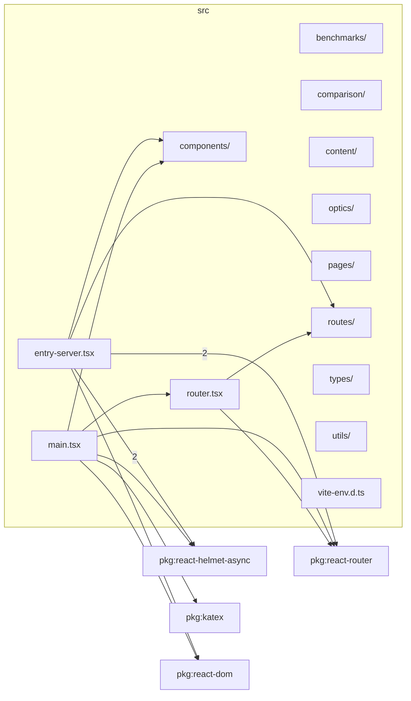

# src

This folder application source root tying browser entry points, SSR, routes, pages, components, utilities, optics, lens data, mounts, and generated metadata together.

Generated `readme.md` and `improvementsuggestions.md` files are intentionally omitted from the per-file inventory so this document stays focused on source relationships.

## Relationship Diagram

## Directory Overview

- Direct source files: 4
- Direct subfolders: 9
- Main outbound areas: package:react-router (4), package:react-helmet-async (3), package:react-dom (2), src/components/errors (2), src/routes (2), package:katex, src/router.tsx
- External consumers: none
- Skipped documentation subtrees: `src/generated/` (build output), `src/lens-data/`, `src/mounts/`

## Subfolders

| Folder | Role |
| --- | --- |
| [benchmarks/](benchmarks/readme.md) | optics/rendering benchmark helpers that exercise runtime viewer paths outside normal app rendering |
| [comparison/](comparison/readme.md) | comparison-mode state, shared sliders, URL metadata, and two-lens layout composition |
| [components/](components/readme.md) | React UI component root for page chrome, controls, SVG diagrams, analysis display, markdown, hooks, mount diagrams, and error boundaries |
| [content/](content/readme.md) | auto-discovered markdown articles and static site content |
| [optics/](optics/readme.md) | pure optical engine, runtime-lens construction, tracing, analysis, projection, glass, mount rendering, and diagram geometry |
| [pages/](pages/readme.md) | route-level React pages and page-specific lens-index feature module |
| [routes/](routes/readme.md) | shared route manifest used by browser routing, SSR, prerender, and sitemap coverage |
| [types/](types/readme.md) | shared TypeScript type surfaces for optics, reducer state, mount diagrams, group movement, and themes |
| [utils/](utils/readme.md) | shared app utilities for config, catalog, content, error reporting, feature flags, media queries, performance probes, SEO, state, style, and themes |

## Files

| File | Role | Imports from | Imported by | Exports |
| --- | --- | --- | --- | --- |
| `entry-server.tsx` | React component module | package:react-helmet-async (2), package:react-router (2), package:react-dom, src/components/errors, src/routes | none | manifestPaths, RenderResult, render |
| `main.tsx` | React component module | package:katex, package:react-dom, package:react-helmet-async, package:react-router, src/components/errors, +1 more | none | none |
| `router.tsx` | React component module | package:react-router, src/routes | src/main.tsx | default |
| `vite-env.d.ts` | Ambient/type declaration surface | none | none | none |

