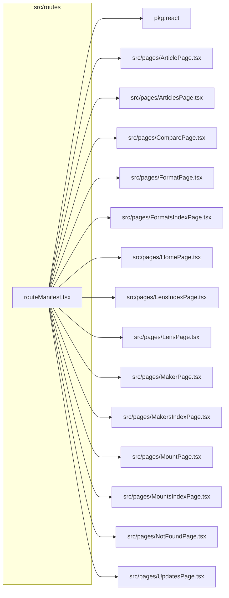

# src/routes

This folder shared route manifest used by browser routing, SSR, prerender, and sitemap coverage.

Generated `readme.md` and `improvementsuggestions.md` files are intentionally omitted from the per-file inventory so this document stays focused on source relationships.

## Relationship Diagram

## Directory Overview

- Direct source files: 1
- Direct subfolders: 0
- Main outbound areas: package:react, src/pages/ArticlePage.tsx, src/pages/ArticlesPage.tsx, src/pages/ComparePage.tsx, src/pages/FormatPage.tsx, src/pages/FormatsIndexPage.tsx, src/pages/HomePage.tsx, src/pages/LensIndexPage.tsx, +7 more
- External consumers: src/entry-server.tsx, src/router.tsx

## Files

| File | Role | Imports from | Imported by | Exports |
| --- | --- | --- | --- | --- |
| `routeManifest.tsx` | React component module | package:react, src/pages/ArticlePage.tsx, src/pages/ArticlesPage.tsx, src/pages/ComparePage.tsx, src/pages/FormatPage.tsx, +10 more | src/entry-server.tsx, src/router.tsx | RouteManifestEntry, default |

