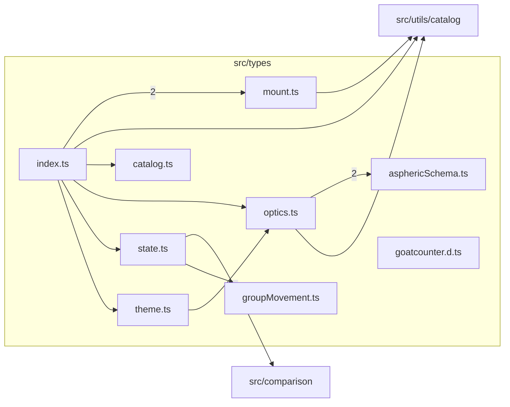

# src/types

This folder shared TypeScript type surfaces for optics, reducer state, mount diagrams, group movement, and themes.

Generated `readme.md` and `improvementsuggestions.md` files are intentionally omitted from the per-file inventory so this document stays focused on source relationships.

## Relationship Diagram

```mermaid
flowchart LR
  subgraph n_src_types["src/types"]
    n_src_types_src_types_asphericSchema_ts["asphericSchema.ts"]
    n_src_types_src_types_catalog_ts["catalog.ts"]
    n_src_types_src_types_goatcounter_d_ts["goatcounter.d.ts"]
    n_src_types_src_types_groupMovement_ts["groupMovement.ts"]
    n_src_types_src_types_index_ts["index.ts"]
    n_src_types_src_types_mount_ts["mount.ts"]
    n_src_types_src_types_optics_ts["optics.ts"]
    n_src_types_src_types_state_ts["state.ts"]
    n_src_types_src_types_theme_ts["theme.ts"]
  end
  n_external_src_comparison["src/comparison"]
  n_external_src_utils_catalog["src/utils/catalog"]
  n_src_types_src_types_state_ts --> |2| n_external_src_comparison
  n_src_types_src_types_optics_ts --> |2| n_src_types_src_types_asphericSchema_ts
  n_src_types_src_types_index_ts --> |2| n_src_types_src_types_mount_ts
  n_src_types_src_types_index_ts --> n_external_src_utils_catalog
  n_src_types_src_types_mount_ts --> n_external_src_utils_catalog
  n_src_types_src_types_optics_ts --> n_external_src_utils_catalog
  n_src_types_src_types_index_ts --> n_src_types_src_types_catalog_ts
  n_src_types_src_types_state_ts --> n_src_types_src_types_groupMovement_ts
  n_src_types_src_types_index_ts --> n_src_types_src_types_optics_ts
  n_src_types_src_types_theme_ts --> n_src_types_src_types_optics_ts
  n_src_types_src_types_index_ts --> n_src_types_src_types_state_ts
  n_src_types_src_types_index_ts --> n_src_types_src_types_theme_ts
```

## Directory Overview

- Direct source files: 9
- Direct subfolders: 0
- Main outbound areas: same folder (10), src/utils/catalog (3), src/comparison (2)
- External consumers: src/benchmarks, src/comparison, src/components/content, src/components/controls, src/components/diagram, src/components/display, src/components/homepage, src/components/hooks, +44 more

## Files

| File | Role | Imports from | Imported by | Exports |
| --- | --- | --- | --- | --- |
| `asphericSchema.ts` | Shared TypeScript types | none | same folder, src/optics/internal, src/optics/validateLensData.ts | AsphericCoefficientDescriptor, ASPHERIC_COEFFICIENT_SCHEMA, AsphericPolynomialDescriptor, ASPHERIC_POLYNOMIAL_TERMS, AsphericCoefficients |
| `catalog.ts` | Shared TypeScript types | none | src/utils/catalog (6), src/pages/lensIndex (3), src/components/relationshipMap (2), same folder | PatentPartyMetadata, CorporateRelationshipEvent, CorporateRelationshipPeriod, CorporateFamilyPeriod, AssigneeCorporateRelationships, AssigneeMetadata, PatentLensRef, PatentPartyRole |
| `goatcounter.d.ts` | Ambient/type declaration surface | none | none | none |
| `groupMovement.ts` | Shared TypeScript types | none | src/components/layout (2), src/utils/state (2), same folder, src/comparison, src/components/controls, +4 more | GROUP_MOVEMENT_MODES, GroupMovementMode, isGroupMovementMode |
| `index.ts` | Shared TypeScript types | same folder (6), src/utils/catalog | none | ImageFormatId, ImageFormatMetadata, LensMountId, LensMountMetadata, SurfaceData, AsphericCoefficients, ElementData, AnnotationData, +93 more |
| `mount.ts` | Shared TypeScript types | src/utils/catalog | src/optics/mount (9), same folder, src/components/mount | MOUNT_SCHEMA_VERSION, MountSchemaVersion, MountProfileId, ResearchStatus, MvpStatus, DiagramStatus, MountMechanism, MountLockType, +40 more |
| `optics.ts` | Shared TypeScript types | same folder (2), src/utils/catalog | src/components/display (22), src/components/diagram (13), src/optics/trace (10), src/components/layout (9), src/optics/analysis (9), +37 more | RadialPhaseTerm, DiffractivePhaseSurface, SurfaceData, SurfaceIncidentSide, SurfaceInactiveSideBehavior, SurfaceInteractionType, MirrorKind, SurfaceInteraction, +53 more |
| `state.ts` | Shared TypeScript types | src/comparison (2), same folder | src/components/layout (11), src/utils/state (8), src/components/hooks (7), src/comparison (4), src/components/controls (2), +6 more | SharedSlidersSlice, ComparisonAction, OFF_AXIS_MODES, RAY_DENSITIES, MOBILE_VIEWS, DESKTOP_VIEWS, ANALYSIS_TAB_IDS, OffAxisMode, +27 more |
| `theme.ts` | Shared TypeScript types | same folder | src/components/display (43), src/components/layout (20), src/components/diagram (15), src/components/content (9), src/components/controls (9), +13 more | ThemeInternalTokens, ThemeColorTokens, Theme, ThemeVariant |
