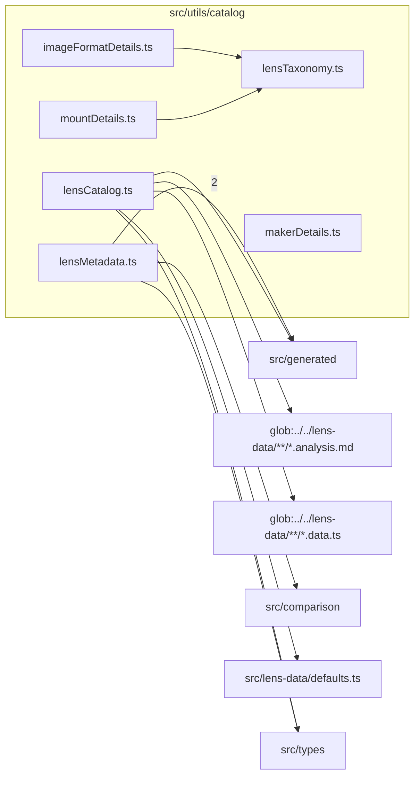

# src/utils/catalog

This folder lens, maker, mount, image-format, and metadata catalog helpers.

Generated `readme.md` and `improvementsuggestions.md` files are intentionally omitted from the per-file inventory so this document stays focused on source relationships.

## Relationship Diagram

## Directory Overview

- Direct source files: 6
- Direct subfolders: 0
- Main outbound areas: src/generated (3), same folder (2), src/types (2), glob:../../lens-data/**/*.analysis.md, glob:../../lens-data/**/*.data.ts, src/comparison, src/lens-data/defaults.ts
- External consumers: src/benchmarks, src/comparison, src/components/homepage, src/components/hooks, src/components/layout, src/components/SEOHead.tsx, src/optics/field, src/optics/mount, +19 more

## Files

| File | Role | Imports from | Imported by | Exports |
| --- | --- | --- | --- | --- |
| `imageFormatDetails.ts` | Image Format Details helper module | same folder | src/pages/FormatPage.tsx, src/pages/FormatsIndexPage.tsx | ImageFormatDetails, IMAGE_FORMAT_DETAILS, getImageFormatDetails |
| `lensCatalog.ts` | Lens Catalog helper module | glob:../../lens-data/**/*.analysis.md, glob:../../lens-data/**/*.data.ts, src/generated, src/lens-data/defaults.ts, src/types | src/components/homepage (2), src/components/layout (2), src/benchmarks, src/comparison, src/components/hooks, +9 more | LENS_CATALOG, ALL_CATALOG_KEYS, CATALOG_KEYS, DEBUG_CATALOG_KEYS, isDebugLensKey, mdForKey, RECENT_LENS_KEYS, ALL_LENSES_BY_DATE, +1 more |
| `lensMetadata.ts` | Lens Metadata helper module | src/generated (2), src/comparison, src/types | src/components/homepage, src/components/layout, src/components/SEOHead.tsx, src/pages/ArticlePage.tsx, src/pages/ArticlesPage.tsx, +14 more | MakerInfo, deriveMaker, allMakerSlugs, makerDisplayName, lensPatentReference, lensPageTitle, lensPageDescription, lensCanonicalURL, +15 more |
| `lensTaxonomy.ts` | Lens Taxonomy helper module | none | src/pages/lensIndex (7), src/types (3), same folder (2), src/components/layout, src/optics/field, +5 more | LENS_MOUNTS, LensMountId, LensMountMetadata, LENS_MOUNT_BY_ID, isLensMountId, IMAGE_FORMATS, ImageFormatId, ImageFormatMetadata, +4 more |
| `makerDetails.ts` | Maker Details helper module | none | src/pages/lensIndex, src/pages/MakerPage.tsx, src/pages/MakersIndexPage.tsx | MakerDetails, MAKER_DETAILS, getMakerDetails |
| `mountDetails.ts` | Mount Details helper module | same folder | src/pages/MountPage.tsx, src/pages/MountsIndexPage.tsx | MountDetails, MOUNT_DETAILS, getMountDetails |

