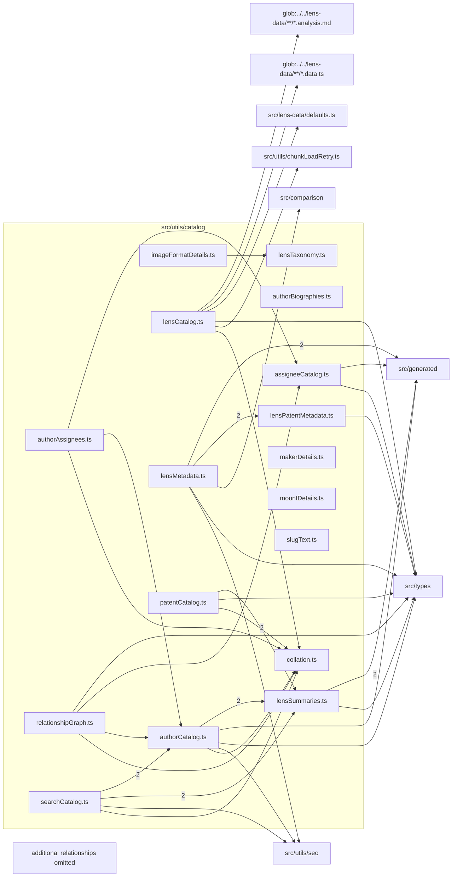

# src/utils/catalog

This folder lens, maker, mount, image-format, and metadata catalog helpers.

Generated `readme.md` and `improvementsuggestions.md` files are intentionally omitted from the per-file inventory so this document stays focused on source relationships.

## Relationship Diagram

```mermaid
flowchart LR
  subgraph n_src_utils_catalog["src/utils/catalog"]
    n_src_utils_catalog_src_utils_catalog_assigneeCatalog_ts["assigneeCatalog.ts"]
    n_src_utils_catalog_src_utils_catalog_authorAssignees_ts["authorAssignees.ts"]
    n_src_utils_catalog_src_utils_catalog_authorBiographies_ts["authorBiographies.ts"]
    n_src_utils_catalog_src_utils_catalog_authorCatalog_ts["authorCatalog.ts"]
    n_src_utils_catalog_src_utils_catalog_collation_ts["collation.ts"]
    n_src_utils_catalog_src_utils_catalog_imageFormatDetails_ts["imageFormatDetails.ts"]
    n_src_utils_catalog_src_utils_catalog_lensCatalog_ts["lensCatalog.ts"]
    n_src_utils_catalog_src_utils_catalog_lensMetadata_ts["lensMetadata.ts"]
    n_src_utils_catalog_src_utils_catalog_lensPatentMetadata_ts["lensPatentMetadata.ts"]
    n_src_utils_catalog_src_utils_catalog_lensSummaries_ts["lensSummaries.ts"]
    n_src_utils_catalog_src_utils_catalog_lensTaxonomy_ts["lensTaxonomy.ts"]
    n_src_utils_catalog_src_utils_catalog_makerDetails_ts["makerDetails.ts"]
    n_src_utils_catalog_src_utils_catalog_mountDetails_ts["mountDetails.ts"]
    n_src_utils_catalog_src_utils_catalog_patentCatalog_ts["patentCatalog.ts"]
    n_src_utils_catalog_src_utils_catalog_relationshipGraph_ts["relationshipGraph.ts"]
    n_src_utils_catalog_src_utils_catalog_searchCatalog_ts["searchCatalog.ts"]
    n_src_utils_catalog_src_utils_catalog_slugText_ts["slugText.ts"]
  end
  n_external_src_generated["src/generated"]
  n_external_glob_______lens_data______analysis_md["glob:../../lens-data/**/*.analysis.md"]
  n_external_glob_______lens_data______data_ts["glob:../../lens-data/**/*.data.ts"]
  n_external_src_comparison["src/comparison"]
  n_external_src_lens_data_defaults_ts["src/lens-data/defaults.ts"]
  n_external_src_types["src/types"]
  n_external_src_utils_chunkLoadRetry_ts["src/utils/chunkLoadRetry.ts"]
  n_external_src_utils_seo["src/utils/seo"]
  n_src_utils_catalog_src_utils_catalog_lensMetadata_ts --> |2| n_external_src_generated
  n_src_utils_catalog_src_utils_catalog_lensSummaries_ts --> |2| n_external_src_generated
  n_src_utils_catalog_src_utils_catalog_searchCatalog_ts --> |2| n_src_utils_catalog_src_utils_catalog_authorCatalog_ts
  n_src_utils_catalog_src_utils_catalog_lensMetadata_ts --> |2| n_src_utils_catalog_src_utils_catalog_lensPatentMetadata_ts
  n_src_utils_catalog_src_utils_catalog_authorCatalog_ts --> |2| n_src_utils_catalog_src_utils_catalog_lensSummaries_ts
  n_src_utils_catalog_src_utils_catalog_patentCatalog_ts --> |2| n_src_utils_catalog_src_utils_catalog_lensSummaries_ts
  n_src_utils_catalog_src_utils_catalog_searchCatalog_ts --> |2| n_src_utils_catalog_src_utils_catalog_lensSummaries_ts
  n_src_utils_catalog_src_utils_catalog_lensCatalog_ts --> n_external_glob_______lens_data______analysis_md
  n_src_utils_catalog_src_utils_catalog_lensCatalog_ts --> n_external_glob_______lens_data______data_ts
  n_src_utils_catalog_src_utils_catalog_lensMetadata_ts --> n_external_src_comparison
  n_src_utils_catalog_src_utils_catalog_assigneeCatalog_ts --> n_external_src_generated
  n_src_utils_catalog_src_utils_catalog_authorCatalog_ts --> n_external_src_generated
  n_src_utils_catalog_src_utils_catalog_lensCatalog_ts --> n_external_src_lens_data_defaults_ts
  n_src_utils_catalog_src_utils_catalog_assigneeCatalog_ts --> n_external_src_types
  n_src_utils_catalog_src_utils_catalog_authorCatalog_ts --> n_external_src_types
  n_src_utils_catalog_src_utils_catalog_lensCatalog_ts --> n_external_src_types
  n_src_utils_catalog_src_utils_catalog_lensMetadata_ts --> n_external_src_types
  n_src_utils_catalog_src_utils_catalog_lensPatentMetadata_ts --> n_external_src_types
  n_src_utils_catalog_src_utils_catalog_lensSummaries_ts --> n_external_src_types
  n_src_utils_catalog_src_utils_catalog_patentCatalog_ts --> n_external_src_types
  n_src_utils_catalog_src_utils_catalog_relationshipGraph_ts --> n_external_src_types
  n_src_utils_catalog_src_utils_catalog_lensCatalog_ts --> n_external_src_utils_chunkLoadRetry_ts
  n_src_utils_catalog_src_utils_catalog_authorCatalog_ts --> n_external_src_utils_seo
  n_src_utils_catalog_src_utils_catalog_lensMetadata_ts --> n_external_src_utils_seo
  n_src_utils_catalog_src_utils_catalog_searchCatalog_ts --> n_external_src_utils_seo
  n_src_utils_catalog_src_utils_catalog_authorAssignees_ts --> n_src_utils_catalog_src_utils_catalog_assigneeCatalog_ts
  n_src_utils_catalog_src_utils_catalog_relationshipGraph_ts --> n_src_utils_catalog_src_utils_catalog_assigneeCatalog_ts
  n_src_utils_catalog_src_utils_catalog_authorAssignees_ts --> n_src_utils_catalog_src_utils_catalog_authorCatalog_ts
  n_src_utils_catalog_src_utils_catalog_relationshipGraph_ts --> n_src_utils_catalog_src_utils_catalog_authorCatalog_ts
  n_src_utils_catalog_src_utils_catalog_authorAssignees_ts --> n_src_utils_catalog_src_utils_catalog_collation_ts
  n_src_utils_catalog_src_utils_catalog_authorCatalog_ts --> n_src_utils_catalog_src_utils_catalog_collation_ts
  n_src_utils_catalog_src_utils_catalog_lensCatalog_ts --> n_src_utils_catalog_src_utils_catalog_collation_ts
  n_src_utils_catalog_src_utils_catalog_patentCatalog_ts --> n_src_utils_catalog_src_utils_catalog_collation_ts
  n_src_utils_catalog_src_utils_catalog_relationshipGraph_ts --> n_src_utils_catalog_src_utils_catalog_collation_ts
  n_src_utils_catalog_src_utils_catalog_searchCatalog_ts --> n_src_utils_catalog_src_utils_catalog_collation_ts
  n_src_utils_catalog_src_utils_catalog_imageFormatDetails_ts --> n_src_utils_catalog_src_utils_catalog_lensTaxonomy_ts
  n_src_utils_catalog_truncated["additional relationships omitted"]
```

## Directory Overview

- Direct source files: 17
- Direct subfolders: 0
- Main outbound areas: same folder (24), src/types (8), src/generated (6), src/utils/seo (3), glob:../../lens-data/**/*.analysis.md, glob:../../lens-data/**/*.data.ts, src/comparison, src/lens-data/defaults.ts, +1 more
- External consumers: src/benchmarks, src/comparison, src/components/controls, src/components/homepage, src/components/hooks, src/components/layout, src/components/relationshipMap, src/components/search, +27 more

## Files

| File | Role | Imports from | Imported by | Exports |
| --- | --- | --- | --- | --- |
| `assigneeCatalog.ts` | Assignee Catalog helper module | src/generated, src/types | same folder (2), src/components/relationshipMap (2), src/pages/RelationshipMapPage.tsx | AssigneeMetadata, ASSIGNEES, getAssigneeBySlug, getAssigneeByName |
| `authorAssignees.ts` | Author Assignees helper module | same folder (3) | src/pages/AuthorsIndexPage.tsx | ALL_AUTHOR_ASSIGNEES, UNASSIGNED_AUTHORS, AuthorDirectoryEntry, AuthorAssigneeStratum, AUTHOR_DIRECTORY_ENTRIES, AUTHOR_ASSIGNEE_STRATA, UNASSIGNED_AUTHOR_COUNT, filterAuthorsByAssignee |
| `authorBiographies.ts` | Author Biographies helper module | none | src/pages/AuthorPage.tsx, src/pages/AuthorsIndexPage.tsx | AuthorBiographySource, AuthorBiography, AUTHOR_BIOGRAPHIES, getAuthorBiography |
| `authorCatalog.ts` | Author Catalog helper module | same folder (3), src/generated, src/types, src/utils/seo | same folder (3), src/components/relationshipMap (2), src/components/controls, src/pages/AuthorPage.tsx, src/pages/AuthorsIndexPage.tsx, +2 more | AuthorMetadata, AuthorPatentLens, AuthorPatent, AuthorGroupMode, AuthorPatentGroup, AUTHORS, getAuthorBySlug, getAuthorByName, +4 more |
| `collation.ts` | Collation helper module | none | same folder (6), src/pages/lensIndex (3), src/pages/AuthorsIndexPage.tsx, src/pages/MakersIndexPage.tsx, src/pages/MountPage.tsx, +1 more | catalogCollator |
| `imageFormatDetails.ts` | Image Format Details helper module | same folder | src/pages/FormatPage.tsx, src/pages/FormatsIndexPage.tsx | ImageFormatDetails, IMAGE_FORMAT_DETAILS, getImageFormatDetails |
| `lensCatalog.ts` | Lens Catalog helper module | glob:../../lens-data/**/*.analysis.md, glob:../../lens-data/**/*.data.ts, same folder, src/lens-data/defaults.ts, src/types, +1 more | src/components/layout (4), src/components/hooks (2), src/benchmarks, src/comparison, src/pages/ComparePage.tsx, +2 more | OpticalConfigurationOption, LENS_CATALOG, ALL_CATALOG_KEYS, CATALOG_KEYS, DEBUG_CATALOG_KEYS, isDebugLensKey, opticalConfigurationOptionsForKey, hasMdForKey, +2 more |
| `lensMetadata.ts` | Lens Metadata helper module | same folder (2), src/generated (2), src/comparison, src/types, src/utils/seo | src/components/homepage, src/components/layout, src/components/SEOHead.tsx, src/pages/ArticlePage.tsx, src/pages/ArticlesPage.tsx, +19 more | MakerInfo, deriveMaker, allMakerSlugs, makerDisplayName, lensPageTitle, lensPageDescription, lensCanonicalURL, makerCanonicalURL, +17 more |
| `lensPatentMetadata.ts` | Lens Patent Metadata helper module | src/types | same folder, src/components/controls | LensPatentAttribution, lensPatentAttribution, lensDisplaySubtitle, lensPatentReference |
| `lensSummaries.ts` | Lens Summaries helper module | src/generated (2), same folder, src/types | same folder (3), src/components/homepage (2), src/pages/lensIndex (2), src/pages/HomePage.tsx, src/pages/LensIndexPage.tsx, +4 more | LensSummary, LENS_SUMMARIES, ALL_SUMMARY_KEYS, SUMMARY_KEYS, DEBUG_SUMMARY_KEYS, isDebugSummaryKey, ALL_LENSES_BY_DATE, RECENT_LENS_KEYS, +1 more |
| `lensTaxonomy.ts` | Lens Taxonomy helper module | none | src/pages/lensIndex (7), same folder (3), src/types (3), src/components/layout, src/optics/field, +5 more | LENS_MOUNTS, LensMountId, LensMountMetadata, LENS_MOUNT_BY_ID, isLensMountId, IMAGE_FORMATS, ImageFormatId, ImageFormatMetadata, +4 more |
| `makerDetails.ts` | Maker Details helper module | none | src/pages/lensIndex, src/pages/MakerPage.tsx, src/pages/MakersIndexPage.tsx | MakerDetails, MAKER_DETAILS, getMakerDetails |
| `mountDetails.ts` | Mount Details helper module | same folder | src/pages/MountPage.tsx, src/pages/MountsIndexPage.tsx | MountDetails, MOUNT_DETAILS, getMountDetails |
| `patentCatalog.ts` | Patent Catalog helper module | same folder (3), src/types | src/pages/PatentsIndexPage.tsx | PatentLens, PatentJurisdiction, PatentRecord, PatentAssigneeGroup, PatentCountryGroup, PatentIndex, PATENT_ASSIGNEE_FALLBACK, espacenetPatentUrl, +4 more |
| `relationshipGraph.ts` | Relationship Graph helper module | same folder (3), src/types | src/components/relationshipMap (4), src/pages/RelationshipMapPage.tsx | PartyRef, GraphPatentNode, GraphPartyNode, RelationshipGraph, resolveFocusParam, buildRelationshipGraph |
| `searchCatalog.ts` | Search Catalog helper module | same folder (6), src/utils/seo | src/components/search (2), src/components/relationshipMap | LensNameSearchMatch, PatentSearchMatch, AuthorSearchMatch, CatalogSearchResults, CatalogSearchMatch, normalizeSearchText, searchCatalog, exactSearchTarget |
| `slugText.ts` | Slug Text helper module | none | same folder, src/pages/lensIndex | transliterateCatalogText, stableHash |
