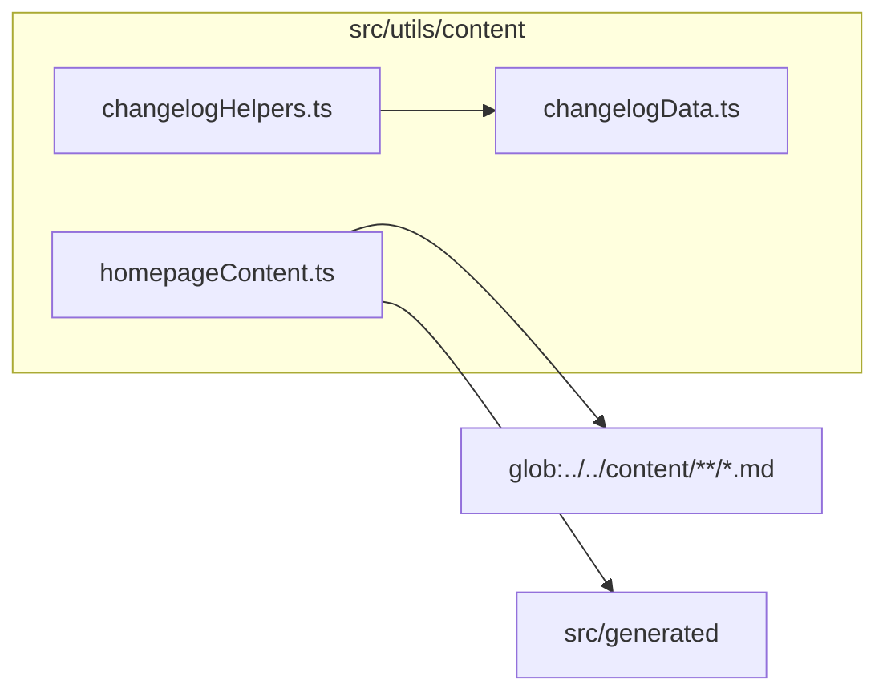

# src/utils/content

This folder article/changelog/homepage content registries and display helpers.

Generated `readme.md` and `improvementsuggestions.md` files are intentionally omitted from the per-file inventory so this document stays focused on source relationships.

## Relationship Diagram

## Directory Overview

- Direct source files: 3
- Direct subfolders: 0
- Main outbound areas: glob:../../content/**/*.md, same folder, src/generated
- External consumers: src/components/content, src/components/homepage, src/components/layout, src/pages/ArticlePage.tsx, src/pages/ArticlesPage.tsx, src/pages/HomePage.tsx, src/pages/UpdatesPage.tsx

## Files

| File | Role | Imports from | Imported by | Exports |
| --- | --- | --- | --- | --- |
| `changelogData.ts` | Changelog Data helper module | none | same folder, src/components/content | ChangelogEntryType, ChangelogEntry, CHANGELOG |
| `changelogHelpers.ts` | Changelog Helpers helper module | same folder | src/components/content, src/pages/UpdatesPage.tsx | CHANGELOG_TYPE_COLORS, CHANGELOG_TYPE_LABELS, formatDisplayDate, groupChangelogByDate |
| `homepageContent.ts` | Homepage Content helper module | glob:../../content/**/*.md, src/generated | src/components/content (3), src/components/homepage, src/components/layout, src/pages/ArticlePage.tsx, src/pages/ArticlesPage.tsx, +1 more | HomepageArticle, ArticleContentEntry, SeriesSummary, HOMEPAGE_ARTICLE_LIMIT, stripFrontmatter, ARTICLES, ARTICLE_SERIES, HOMEPAGE_ARTICLES, +1 more |

