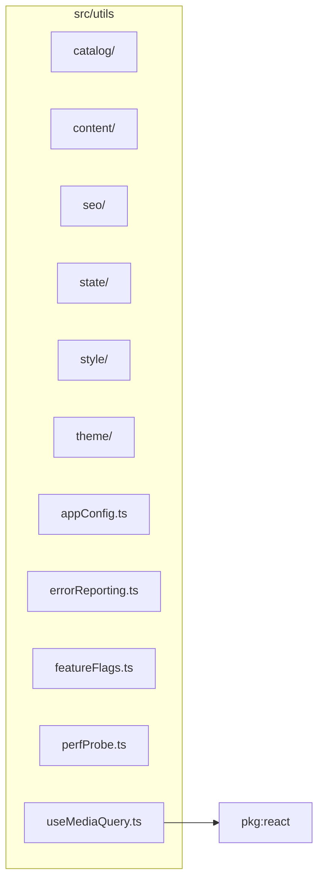

# src/utils

This folder shared app utilities for config, catalog, content, error reporting, feature flags, media queries, performance probes, SEO, state, style, and themes.

Generated `readme.md` and `improvementsuggestions.md` files are intentionally omitted from the per-file inventory so this document stays focused on source relationships.

## Relationship Diagram

## Directory Overview

- Direct source files: 5
- Direct subfolders: 6
- Main outbound areas: package:react
- External consumers: src/benchmarks, src/components/controls, src/components/diagram, src/components/display, src/components/errors, src/components/homepage, src/components/hooks, src/components/layout, +4 more

## Subfolders

| Folder | Role |
| --- | --- |
| [catalog/](catalog/readme.md) | lens, maker, mount, image-format, and metadata catalog helpers |
| [content/](content/readme.md) | article/changelog/homepage content registries and display helpers |
| [seo/](seo/readme.md) | shared structured-data and freshness helpers for route metadata |
| [state/](state/readme.md) | LensViewer reducer, contexts, preferences, URL parsing/sync, and zoom conversions |
| [style/](style/readme.md) | inline-style fragments and shared control styling helpers |
| [theme/](theme/readme.md) | theme variants, page theme hooks, constants, and persisted theme preferences |

## Files

| File | Role | Imports from | Imported by | Exports |
| --- | --- | --- | --- | --- |
| `appConfig.ts` | App Config helper module | none | src/utils/state | DEFAULT_COLOR_TRACING |
| `errorReporting.ts` | Error Reporting helper module | none | src/components/errors | REPO_URL, buildIssueURL |
| `featureFlags.ts` | Feature Flags helper module | none | src/components/layout (3), src/components/controls (2), src/components/diagram (2), src/components/display (2), src/components/hooks, +2 more | ENABLE_UNIFORM_SCALING, ENABLE_ASPH_DIAMOND_FILL, ENABLE_EDGE_PROJECTION, ENABLE_REAL_RAY_LSA_DIAGNOSTIC, ENABLE_CARDINAL_ELEMENTS |
| `perfProbe.ts` | Perf Probe helper module | none | src/components/display (6), src/benchmarks | probe, resetPerfProbe |
| `useMediaQuery.ts` | React hook module | package:react | src/components/homepage (3), src/components/layout (3), src/pages/HomePage.tsx, src/pages/UpdatesPage.tsx, src/utils/state | default, useMediaQuery |

