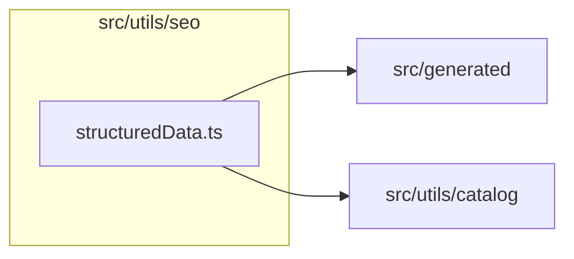

# src/utils/seo

This folder shared structured-data and freshness helpers for route metadata.

Generated `readme.md` and `improvementsuggestions.md` files are intentionally omitted from the per-file inventory so this document stays focused on source relationships.

## Relationship Diagram

## Directory Overview

- Direct source files: 1
- Direct subfolders: 0
- Main outbound areas: src/generated, src/utils/catalog
- External consumers: src/pages/ArticlePage.tsx, src/pages/ArticlesPage.tsx, src/pages/FormatPage.tsx, src/pages/FormatsIndexPage.tsx, src/pages/HomePage.tsx, src/pages/LensIndexPage.tsx, src/pages/LensPage.tsx, src/pages/MakerPage.tsx, +4 more

## Files

| File | Role | Imports from | Imported by | Exports |
| --- | --- | --- | --- | --- |
| `structuredData.ts` | Structured Data helper module | src/generated, src/utils/catalog | src/pages/ArticlePage.tsx, src/pages/ArticlesPage.tsx, src/pages/FormatPage.tsx, src/pages/FormatsIndexPage.tsx, src/pages/HomePage.tsx, +7 more | ListItemEntry, BreadcrumbEntry, publisherJsonLd, websiteJsonLd, webApplicationJsonLd, datasetJsonLd, collectionPageJsonLd, itemListJsonLd, +4 more |

