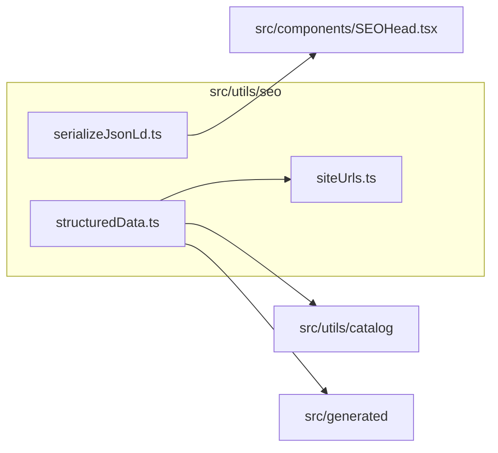

# src/utils/seo

This folder shared structured-data and freshness helpers for route metadata.

Generated `readme.md` and `improvementsuggestions.md` files are intentionally omitted from the per-file inventory so this document stays focused on source relationships.

## Relationship Diagram

```mermaid
flowchart LR
  subgraph n_src_utils_seo["src/utils/seo"]
    n_src_utils_seo_src_utils_seo_serializeJsonLd_ts["serializeJsonLd.ts"]
    n_src_utils_seo_src_utils_seo_siteUrls_ts["siteUrls.ts"]
    n_src_utils_seo_src_utils_seo_structuredData_ts["structuredData.ts"]
  end
  n_external_src_components_SEOHead_tsx["src/components/SEOHead.tsx"]
  n_external_src_generated["src/generated"]
  n_external_src_utils_catalog["src/utils/catalog"]
  n_src_utils_seo_src_utils_seo_serializeJsonLd_ts --> n_external_src_components_SEOHead_tsx
  n_src_utils_seo_src_utils_seo_structuredData_ts --> n_external_src_generated
  n_src_utils_seo_src_utils_seo_structuredData_ts --> n_external_src_utils_catalog
  n_src_utils_seo_src_utils_seo_structuredData_ts --> n_src_utils_seo_src_utils_seo_siteUrls_ts
```

## Directory Overview

- Direct source files: 3
- Direct subfolders: 0
- Main outbound areas: same folder, src/components/SEOHead.tsx, src/generated, src/utils/catalog
- External consumers: src/comparison, src/components/content, src/components/homepage, src/components/layout, src/components/markdown, src/components/search, src/components/SEOHead.tsx, src/pages/ArticlePage.tsx, +20 more

## Files

| File | Role | Imports from | Imported by | Exports |
| --- | --- | --- | --- | --- |
| `serializeJsonLd.ts` | Serialize Json Ld helper module | src/components/SEOHead.tsx | src/components/SEOHead.tsx | serializeJsonLd |
| `siteUrls.ts` | Site Urls helper module | none | src/components/content (3), src/components/homepage (3), src/components/layout (3), src/utils/catalog (3), src/comparison (2), +9 more | SITE_URL, canonicalPagePath, canonicalPageUrl, normalizeSitePageUrl |
| `structuredData.ts` | Structured Data helper module | same folder, src/generated, src/utils/catalog | src/pages/ArticlePage.tsx, src/pages/ArticlesPage.tsx, src/pages/AuthorPage.tsx, src/pages/AuthorsIndexPage.tsx, src/pages/FormatPage.tsx, +12 more | ListItemEntry, BreadcrumbEntry, publisherJsonLd, websiteJsonLd, webApplicationJsonLd, datasetJsonLd, collectionPageJsonLd, itemListJsonLd, +4 more |

