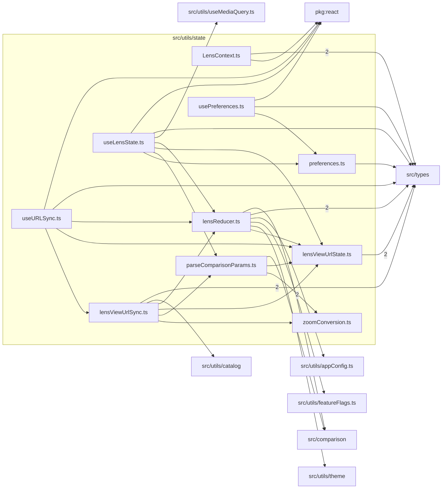

# src/utils/state

This folder LensViewer reducer, contexts, preferences, URL parsing/sync, and zoom conversions.

Generated `readme.md` and `improvementsuggestions.md` files are intentionally omitted from the per-file inventory so this document stays focused on source relationships.

## Relationship Diagram

## Directory Overview

- Direct source files: 10
- Direct subfolders: 0
- Main outbound areas: same folder (15), src/types (12), package:react (4), src/comparison (3), src/utils/appConfig.ts, src/utils/catalog, src/utils/featureFlags.ts, src/utils/theme, +1 more
- External consumers: src/comparison, src/components/hooks, src/components/layout, src/utils/theme

## Files

| File | Role | Imports from | Imported by | Exports |
| --- | --- | --- | --- | --- |
| `LensContext.ts` | Lens Context helper module | src/types (2), package:react | src/components/layout (3), src/components/hooks | LensCtxValue, LensStateContext, LensDispatchContext, useLensCtx, useLensDispatch, PanelStateContext, usePanelCtx |
| `lensReducer.ts` | Lens Reducer module with default export | src/comparison (2), src/types (2), same folder, src/utils/appConfig.ts, src/utils/featureFlags.ts, +1 more | src/components/layout (5), same folder (3), src/components/hooks (2), src/comparison | SET_LENS_A, SET_LENS_B, SWAP_LENSES, SET_DARK, SET_HIGH_CONTRAST, SET_MOBILE_VIEW, SET_DESKTOP_VIEW, SET_RAY_TOGGLE, +25 more |
| `lensViewUrlState.ts` | Lens View Url State helper module | src/types (2) | same folder (5) | LensViewQueryState, BuildLensViewQueryOptions, VIEW_STATE_FIELDS, ViewStateField, ViewStateFieldKey, parseLensViewQuery, buildLensViewQuery, buildLensViewQueryFromState, +1 more |
| `lensViewUrlSync.ts` | Lens View Url Sync helper module | same folder (4), src/types (2), src/utils/catalog | same folder | ComparisonLenses, ComparisonError, ComparisonLensesParam, getComparisonZoomLens, getCatalogZoomLens, getUrlZoomLens, getStateZoom, buildLensViewSearch, +4 more |
| `parseComparisonParams.ts` | Parse Comparison Params helper module | same folder (2), src/comparison | same folder (2), src/comparison | focalLengthToZoomT, zoomTToFocalLength, buildComparePath, BuildURLSliders, parseLensKeysFromSearch, parseComparisonParams, encodeSliderParams, buildComparisonURL |
| `preferences.ts` | Preferences helper module | src/types | same folder (2), src/utils/theme (2) | PREFS_KEY, loadPrefs |
| `useLensState.ts` | React hook module | same folder (4), package:react, src/types, src/utils/useMediaQuery.ts | src/components/layout | default, useLensState |
| `usePreferences.ts` | React hook module | package:react, same folder, src/types | src/components/layout | default, usePreferences |
| `useURLSync.ts` | React hook module | same folder (3), package:react, src/types | src/components/layout | default, useURLSync |
| `zoomConversion.ts` | Zoom Conversion helper module | none | same folder (2) | ZoomConvertibleLens, focalLengthToZoomT, zoomTToFocalLength |

