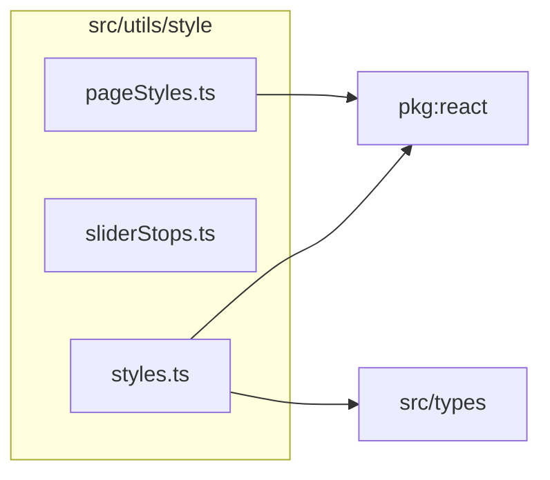

# src/utils/style

This folder inline-style fragments and shared control styling helpers.

Generated `readme.md` and `improvementsuggestions.md` files are intentionally omitted from the per-file inventory so this document stays focused on source relationships.

## Relationship Diagram

## Directory Overview

- Direct source files: 3
- Direct subfolders: 0
- Main outbound areas: package:react (2), src/types
- External consumers: src/comparison, src/components/controls, src/components/display, src/components/layout, src/pages/ArticlePage.tsx, src/pages/ArticlesPage.tsx, src/pages/FormatPage.tsx, src/pages/FormatsIndexPage.tsx, +6 more

## Files

| File | Role | Imports from | Imported by | Exports |
| --- | --- | --- | --- | --- |
| `pageStyles.ts` | Page Styles helper module | package:react | src/components/layout, src/pages/ArticlePage.tsx, src/pages/ArticlesPage.tsx, src/pages/FormatPage.tsx, src/pages/FormatsIndexPage.tsx, +6 more | PAGE_BASE_STYLE, H1_STYLE, SECTION_HEADING_BASE_STYLE, LENS_LINK_BASE_STYLE |
| `sliderStops.ts` | Slider Stops helper module | none | src/comparison (2), src/components/controls | snapToStop, snapToZeroStop |
| `styles.ts` | Styles helper module | package:react, src/types | src/components/layout (8), src/components/controls (7), src/components/display (4), src/comparison | OVERLAY_BACKDROP, OVERLAY_MODAL_BASE, PANEL_OVERLAY_BACKDROP, SLIDER_LABEL, SLIDER_VALUE_BASE, toggleGroup, toggleBtn, chromChannelBtn, +9 more |

