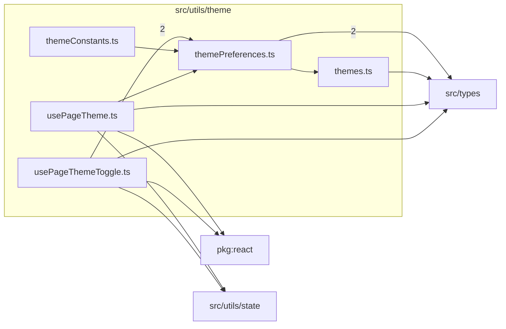

# src/utils/theme

This folder theme variants, page theme hooks, constants, and persisted theme preferences.

Generated `readme.md` and `improvementsuggestions.md` files are intentionally omitted from the per-file inventory so this document stays focused on source relationships.

## Relationship Diagram

## Directory Overview

- Direct source files: 5
- Direct subfolders: 0
- Main outbound areas: same folder (5), src/types (5), package:react (2), src/utils/state (2)
- External consumers: src/benchmarks, src/components/layout, src/pages/ArticlePage.tsx, src/pages/ArticlesPage.tsx, src/pages/FormatPage.tsx, src/pages/FormatsIndexPage.tsx, src/pages/HomePage.tsx, src/pages/LensIndexPage.tsx, +6 more

## Files

| File | Role | Imports from | Imported by | Exports |
| --- | --- | --- | --- | --- |
| `themeConstants.ts` | Theme Constants helper module | same folder | src/components/layout (2) | THEME_ICON, THEME_LABEL |
| `themePreferences.ts` | Theme Preferences helper module | src/types (2), same folder | src/components/layout (4), same folder (3), src/utils/state | ThemeMode, SystemThemePreferences, ResolvedThemePreferences, readSystemThemePreferences, themeModeFromDarkPreference, darkPreferenceFromThemeMode, nextThemeMode, resolveDarkPreference, +4 more |
| `themes.ts` | Themes module with default export | src/types | same folder, src/benchmarks | default |
| `usePageTheme.ts` | React hook module | package:react, same folder, src/types, src/utils/state | none | usePageTheme |
| `usePageThemeToggle.ts` | React hook module | same folder (2), package:react, src/types, src/utils/state | src/components/layout, src/pages/ArticlePage.tsx, src/pages/ArticlesPage.tsx, src/pages/FormatPage.tsx, src/pages/FormatsIndexPage.tsx, +7 more | usePageThemeToggle, ThemeMode |

