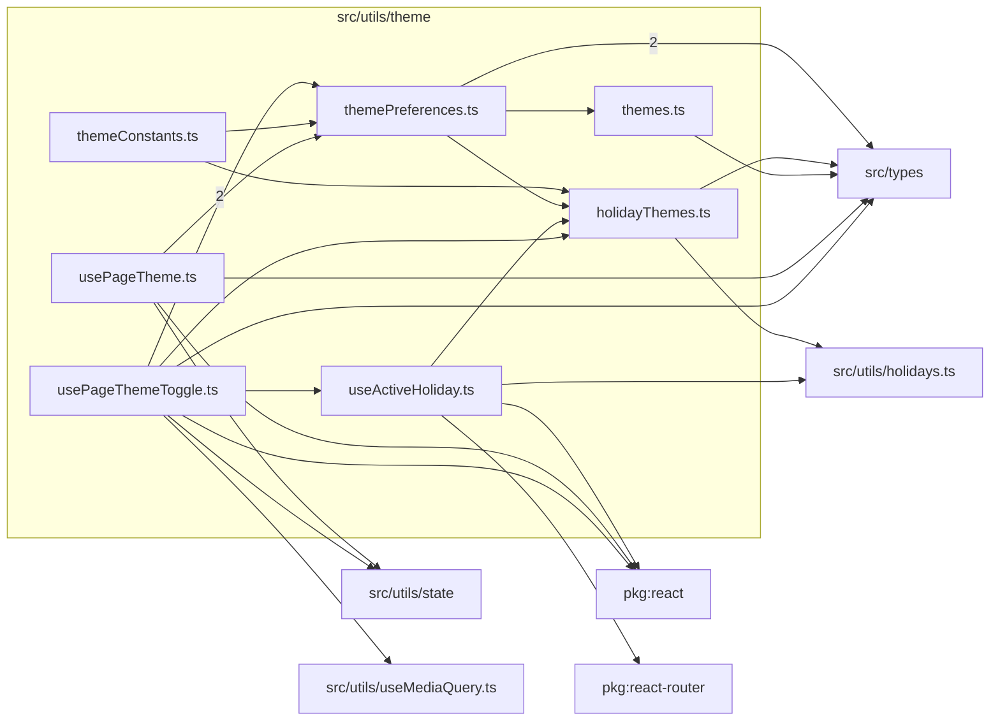

# src/utils/theme

This folder theme variants, page theme hooks, constants, and persisted theme preferences.

Generated `readme.md` and `improvementsuggestions.md` files are intentionally omitted from the per-file inventory so this document stays focused on source relationships.

## Relationship Diagram

```mermaid
flowchart LR
  subgraph n_src_utils_theme["src/utils/theme"]
    n_src_utils_theme_src_utils_theme_holidayThemes_ts["holidayThemes.ts"]
    n_src_utils_theme_src_utils_theme_themeConstants_ts["themeConstants.ts"]
    n_src_utils_theme_src_utils_theme_themePreferences_ts["themePreferences.ts"]
    n_src_utils_theme_src_utils_theme_themes_ts["themes.ts"]
    n_src_utils_theme_src_utils_theme_useActiveHoliday_ts["useActiveHoliday.ts"]
    n_src_utils_theme_src_utils_theme_usePageTheme_ts["usePageTheme.ts"]
    n_src_utils_theme_src_utils_theme_usePageThemeToggle_ts["usePageThemeToggle.ts"]
  end
  n_external_src_types["src/types"]
  n_external_pkg_react["pkg:react"]
  n_external_pkg_react_router["pkg:react-router"]
  n_external_src_utils_holidays_ts["src/utils/holidays.ts"]
  n_external_src_utils_state["src/utils/state"]
  n_external_src_utils_useMediaQuery_ts["src/utils/useMediaQuery.ts"]
  n_src_utils_theme_src_utils_theme_themePreferences_ts --> |2| n_external_src_types
  n_src_utils_theme_src_utils_theme_usePageThemeToggle_ts --> |2| n_src_utils_theme_src_utils_theme_themePreferences_ts
  n_src_utils_theme_src_utils_theme_useActiveHoliday_ts --> n_external_pkg_react
  n_src_utils_theme_src_utils_theme_usePageTheme_ts --> n_external_pkg_react
  n_src_utils_theme_src_utils_theme_usePageThemeToggle_ts --> n_external_pkg_react
  n_src_utils_theme_src_utils_theme_useActiveHoliday_ts --> n_external_pkg_react_router
  n_src_utils_theme_src_utils_theme_holidayThemes_ts --> n_external_src_types
  n_src_utils_theme_src_utils_theme_themes_ts --> n_external_src_types
  n_src_utils_theme_src_utils_theme_usePageTheme_ts --> n_external_src_types
  n_src_utils_theme_src_utils_theme_usePageThemeToggle_ts --> n_external_src_types
  n_src_utils_theme_src_utils_theme_holidayThemes_ts --> n_external_src_utils_holidays_ts
  n_src_utils_theme_src_utils_theme_useActiveHoliday_ts --> n_external_src_utils_holidays_ts
  n_src_utils_theme_src_utils_theme_usePageTheme_ts --> n_external_src_utils_state
  n_src_utils_theme_src_utils_theme_usePageThemeToggle_ts --> n_external_src_utils_state
  n_src_utils_theme_src_utils_theme_usePageThemeToggle_ts --> n_external_src_utils_useMediaQuery_ts
  n_src_utils_theme_src_utils_theme_themeConstants_ts --> n_src_utils_theme_src_utils_theme_holidayThemes_ts
  n_src_utils_theme_src_utils_theme_themePreferences_ts --> n_src_utils_theme_src_utils_theme_holidayThemes_ts
  n_src_utils_theme_src_utils_theme_useActiveHoliday_ts --> n_src_utils_theme_src_utils_theme_holidayThemes_ts
  n_src_utils_theme_src_utils_theme_usePageThemeToggle_ts --> n_src_utils_theme_src_utils_theme_holidayThemes_ts
  n_src_utils_theme_src_utils_theme_themeConstants_ts --> n_src_utils_theme_src_utils_theme_themePreferences_ts
  n_src_utils_theme_src_utils_theme_usePageTheme_ts --> n_src_utils_theme_src_utils_theme_themePreferences_ts
  n_src_utils_theme_src_utils_theme_themePreferences_ts --> n_src_utils_theme_src_utils_theme_themes_ts
  n_src_utils_theme_src_utils_theme_usePageThemeToggle_ts --> n_src_utils_theme_src_utils_theme_useActiveHoliday_ts
```

## Directory Overview

- Direct source files: 7
- Direct subfolders: 0
- Main outbound areas: same folder (10), src/types (6), package:react (3), src/utils/holidays.ts (2), src/utils/state (2), package:react-router, src/utils/useMediaQuery.ts
- External consumers: src/benchmarks, src/components/HolidayFavicon.tsx, src/components/layout, src/pages/ArticlePage.tsx, src/pages/ArticlesPage.tsx, src/pages/FormatPage.tsx, src/pages/FormatsIndexPage.tsx, src/pages/HomePage.tsx, +6 more

## Files

| File | Role | Imports from | Imported by | Exports |
| --- | --- | --- | --- | --- |
| `holidayThemes.ts` | Holiday Themes helper module | src/types, src/utils/holidays.ts | same folder (4), src/components/HolidayFavicon.tsx | HolidayTheme, HOLIDAY_THEMES |
| `themeConstants.ts` | Theme Constants helper module | same folder (2) | src/components/layout (2) | THEME_ICON, THEME_LABEL, themeSlotDisplay |
| `themePreferences.ts` | Theme Preferences helper module | same folder (2), src/types (2) | src/components/layout (4), same folder (3), src/utils/state | ThemeMode, SystemThemePreferences, ResolvedThemePreferences, readSystemThemePreferences, themeModeFromDarkPreference, darkPreferenceFromThemeMode, nextThemeMode, resolveDarkPreference, +6 more |
| `themes.ts` | Themes module with default export | src/types | same folder, src/benchmarks | createTheme, default |
| `useActiveHoliday.ts` | React hook module | package:react, package:react-router, same folder, src/utils/holidays.ts | src/components/layout (3), same folder | useActiveHoliday |
| `usePageTheme.ts` | React hook module | package:react, same folder, src/types, src/utils/state | none | usePageTheme |
| `usePageThemeToggle.ts` | React hook module | same folder (4), package:react, src/types, src/utils/state, src/utils/useMediaQuery.ts | src/components/layout, src/pages/ArticlePage.tsx, src/pages/ArticlesPage.tsx, src/pages/FormatPage.tsx, src/pages/FormatsIndexPage.tsx, +6 more | usePageThemeToggle, ThemeMode |
